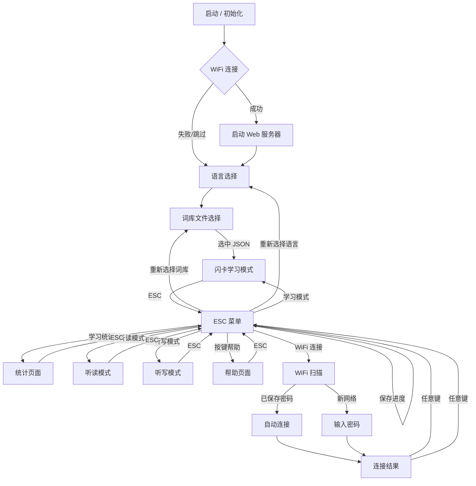

# WordCardputer — 便携单词学习机

基于 **M5Cardputer**（ESP32-S3）的便携单词学习机，支持日语和英语词库的闪卡学习、听写测试、听读练习及学习统计。所有词库和音频存储在 SD 卡上，支持 WiFi 连接后通过浏览器管理设备。

## 功能特色

- **双语支持**：日语 / 英语词库，启动时可切换语言
- **闪卡学习**：中日/中英双向模式，随机切换正反面，按键标记熟练度
- **听写模式**：键盘输入答案（日语支持罗马字转假名），自动判定对错，错误单词可导出
- **听读模式**：自动循环播放单词发音，加权随机抽取不熟悉的词
- **智能抽词**：基于熟练度加权随机（weight = 6 - score），薄弱词汇更高频出现
- **学习统计**：三页统计面板，展示平均分、中位数、掌握评价和各等级分布
- **自动保存**：每 5 次评分变更自动保存进度到 SD 卡
- **Web 控制面板**：WiFi 连接后可通过浏览器管理词库文件、查看统计、调节音量亮度
- **自动节能**：60 秒无操作降低屏幕亮度，降低 CPU 循环频率；WiFi 连接后启用 Modem Sleep 自动省电
- **WiFi 凭据记忆**：连接成功后自动保存密码到 SD 卡，下次扫描时已保存的网络标记 ★，选择后免密码直连

## 快速开始

### 1. 准备 SD 卡

将 `words_study` 文件夹复制到 SD 卡根目录：

```
SD 卡根目录/
└── words_study/
    ├── wifi.json             # WiFi 凭据存储（连接成功后自动生成）
    ├── jp/
    │   ├── word/             # 日语词库 JSON
    │   └── audio/            # 日语发音 WAV
    ├── en/
    │   ├── word/             # 英语词库 JSON
    │   └── audio/            # 英语发音 WAV
    └── www/
        └── index.html        # Web 控制面板前端
```

### 2. 编译与烧录

- 使用 Arduino IDE 或 PlatformIO 打开 `WordCardputer.ino`
- 选择开发板：**M5Stack Cardputer (ESP32-S3)**
- 安装依赖库：M5Cardputer、M5GFX、ArduinoJson
- 编译并上传

### 3. 使用设备

启动后选择语言 → 选择词库文件 → 进入学习。ESC 键（`` ` ``）随时呼出菜单。

## 按键说明

### 通用

| 按键 | 功能 |
|------|------|
| ESC (`` ` ``) | 打开/关闭菜单 |
| `;` / `.` | 音量加/减 |
| `Fn` | 播放发音 |
| `,` / `/` | 翻页（左/右） |

### 学习模式

| 按键 | 功能 |
|------|------|
| `BtnA` | 显示/隐藏释义 |
| `Enter` | 记住（score +1） |
| `Del` | 不熟（score -1） |

### 听写模式

| 按键 | 功能 |
|------|------|
| 字母键 | 输入答案 |
| `Enter` | 提交答案 |
| `Del` | 删除字符 |
| `Shift` | 平/片假名切换 |
| `;` | 确认当前假名 |

## 词库 JSON 格式

日语词库：

```json
[
  { “jp”: “わたし”, “zh”: “我”, “kanji”: “私”, “tone”: 0, “score”: 3 },
  { “jp”: “ほん”, “zh”: “书”, “kanji”: “本”, “tone”: 0, “score”: 3 }
]
```

英语词库：

```json
[
  { “en”: “run”, “zh”: “跑；运行”, “pos”: “verb”, “phonetic”: “/rʌn/”, “score”: 3 },
  { “en”: “apple”, “zh”: “苹果”, “pos”: “noun”, “phonetic”: “/ˈæpəl/”, “score”: 3 }
]
```

音频文件要求：WAV 格式，PCM 编码，8/16-bit，单声道，采样率 ≤ 48kHz。

## Web 控制面板

WiFi 连接后，设备自动启动 HTTP 服务器。通过 ESC 菜单 → “Web 控制台” 查看设备 IP 地址，在同一局域网的浏览器中访问 `http://<IP>` 即可使用：

- **文件管理**：浏览、上传、下载、删除 SD 卡上的词库文件
- **学习统计**：查看当前词库的分数分布和掌握评价
- **设备设置**：实时调节音量和屏幕亮度

## 项目结构

```
WordCardputer/
├── WordCardputer.ino      # 主程序入口（全局变量、setup、loop）
├── Mode*.ino              # 各功能模式
│   ├── ModeLangSelect     #   语言选择
│   ├── ModeFileSelect     #   文件选择
│   ├── ModeStudy          #   闪卡学习
│   ├── ModeDictation      #   听写测试
│   ├── ModeListen         #   听读练习
│   ├── ModeStats          #   学习统计
│   ├── ModeEscMenu        #   ESC 菜单
│   └── ModeKeyHelp        #   按键帮助
├── Utils*.ino             # 工具模块
│   ├── UtilsData          #   JSON 读写、自动保存
│   ├── UtilsAudio         #   WAV 流式播放
│   ├── UtilsMenu          #   菜单与表格渲染
│   ├── UtilsString        #   字符串处理
│   ├── UtilsIme           #   罗马字→假名输入法
│   ├── UtilsWiFi          #   WiFi 连接与 NTP 时间
│   └── UtilsWebServer     #   Web 控制面板服务器
├── util/                  # Python 辅助工具
│   ├── tts.py             #   TTS 语音生成
│   ├── audio.py           #   音频处理
│   ├── json_utils.py      #   词库 JSON 操作
│   └── stats.py           #   词库统计分析
└── words_study/           # SD 卡词库数据
```

## 流程图



## 作者

Author: Mr-xiaotian
Email: mingxiaomingtian@gmail.com
Project Link: [https://github.com/Mr-xiaotian/WordCardputer](https://github.com/Mr-xiaotian/WordCardputer)

> *“让硬件成为记忆的一部分。”*
