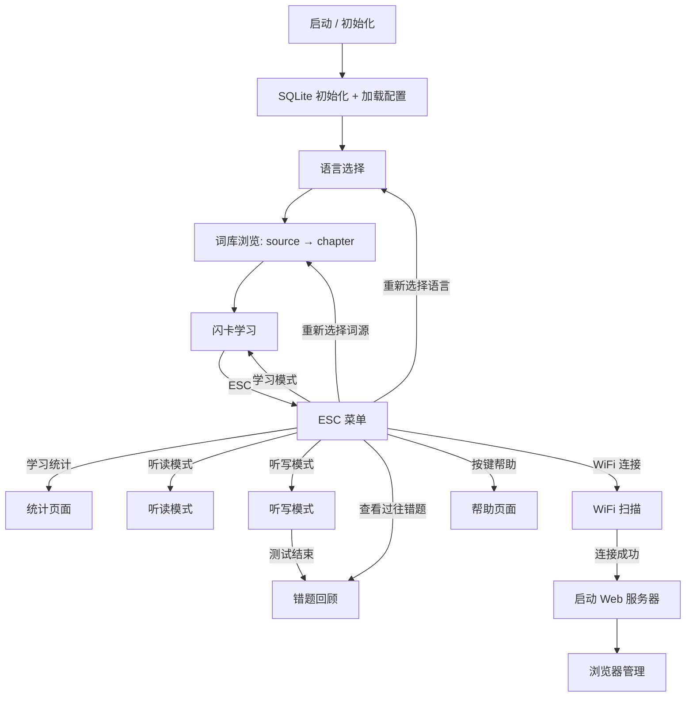

# WordCardputer — 便携单词学习机

> *"让硬件成为记忆的一部分。"*

基于 **M5Cardputer**（ESP32-S3）的便携单词学习机，支持日语和英语词库的闪卡学习、听写测试、听读练习及学习统计。词库数据采用 **SQLite** 存储，音频存储在 SD 卡上，支持 WiFi 连接后通过浏览器管理设备。

## 功能特色

- **双语支持**：日语 / 英语词库，启动时可切换语言
- **闪卡学习**：正反面随机切换，按键标记熟练度（score 1~5）
- **听写模式**：键盘输入答案（日语支持罗马字→假名 IME），自动判定对错
- **错题回顾**：听写结束后可浏览本轮错题，也可从菜单查看历史错题记录
- **听读模式**：自动循环播放单词发音，加权随机抽取不熟悉的词
- **智能抽词**：基于熟练度加权随机（weight = 6 − score），薄弱词汇更高频出现
- **学习统计**：三页统计面板，展示平均分、中位数、掌握评价和各等级分布
- **自动保存**：每 N 次评分变更自动保存到 SQLite 数据库（阈值可配置）
- **Web 控制面板**：WiFi 连接后可通过浏览器管理词库、导入导出 JSON、查看统计、调节设置
- **自动节能**：可配置超时后降低屏幕亮度与 CPU 频率；WiFi 连接后启用 Modem Sleep
- **WiFi 凭据记忆**：连接成功后自动保存密码，已保存网络标记 ★，免密码直连

## 快速开始

### 1. 准备 SD 卡

SD 卡需要以下结构：

```
SD 卡根目录/
└── words_study/
    ├── config.json            # 设备配置（首次启动自动生成）
    ├── .env                   # API Key 等敏感配置（PC 端工具用，可选）
    ├── jp/
    │   ├── jp_words.db        # 日语词库数据库（SQLite）
    │   └── audio/             # 日语发音 WAV
    ├── en/
    │   ├── en_words.db        # 英语词库数据库（SQLite）
    │   └── audio/             # 英语发音 WAV
    └── www/
        └── index.html         # Web 控制面板前端
```

> 数据库文件可通过 Web 控制面板上传 JSON 词库自动导入。PC 端的 `utils/` 目录提供了音频生成和 JSON 预处理工具。

### 2. 编译与烧录

**方法一：使用 build.ps1 脚本（推荐）**

```powershell
.\build.ps1
```

**方法二：手动编译**

- 使用 Arduino IDE 或 PlatformIO 打开 `WordCardputer.ino`
- 选择开发板：**M5Stack Cardputer (ESP32-S3)**
- 安装依赖库：
  - M5Cardputer、M5GFX
  - ArduinoJson
  - **sqlite3**（ESP32 版）
- 编译并上传

**烧录：**

```powershell
.\build.ps1    # 仅编译
.\upload.ps1   # 仅烧录（需先编译）
.\flash.ps1    # 编译 + 烧录
```

### 3. 使用设备

1. 插入 SD 卡，启动设备。
2. 选择语言（日语/英语）。
3. 浏览词库（source → chapter），选中后进入学习。
4. 按 `` ` ``（ESC）随时呼出菜单，切换模式或查看统计。

## 按键说明

### 通用

| 按键 | 功能 |
|------|------|
| ESC (`` ` ``) | 打开/关闭菜单 |
| `;` / `.` | 音量加/减 |
| `Fn` | 播放当前单词发音 |
| `,` / `/` | 翻页（左/右） |

### 学习模式

| 按键 | 功能 |
|------|------|
| `BtnA` | 显示/隐藏释义 |
| `Enter` | 记住（score +1） |
| `Del` | 不熟（score -1） |

### 听写模式

| 按键 | 功能 |
|------|------|
| 字母键 | 输入答案 |
| `Enter` | 提交答案 |
| `Del` | 删除字符 |
| `Shift` | 平/片假名切换 |
| `;` | 确认当前假名 |

### 错题回顾

| 按键 | 功能 |
|------|------|
| `,` / `/` | 上/下一个错题 |
| `Fn` | 重播正确答案语音 |
| `` ` `` | 返回菜单 |

## 词库数据

词库使用 **SQLite 数据库**存储（`jp_words.db` / `en_words.db`），支持以下操作：

- **Web 控制面板**：上传 JSON 文件即可自动导入到数据库；也可将任意 source/chapter 导出为 JSON 备份。
- **PC 端工具**：`utils/json_utils.py` 提供 JSON 合并、去重、拆分等预处理功能。

JSON 导入格式（与旧版兼容）：

日语：

```json
[
  { "jp": "わたし", "zh": "我", "kanji": "私", "tone": 0, "score": 3 },
  { "jp": "ほん", "zh": "书", "kanji": "本", "tone": 0, "score": 3 }
]
```

英语：

```json
[
  { "en": "run", "zh": "跑；运行", "pos": "verb", "phonetic": "/rʌn/", "score": 3 },
  { "en": "apple", "zh": "苹果", "pos": "noun", "phonetic": "/ˈæpəl/", "score": 3 }
]
```

音频文件要求：WAV 格式，PCM 编码，8/16-bit，单/立体声，采样率 ≤ 48 kHz（推荐 16 kHz）。

## Web 控制面板

WiFi 连接后，设备自动启动 HTTP 服务器（端口 80）。在同一局域网浏览器访问 `http://<设备IP>` 即可使用：

- **词库管理**：浏览 source / chapter 结构、上传 JSON 导入、导出数据库为 JSON、删除词库
- **学习统计**：查看当前词库的分数分布和掌握评价
- **设备设置**：调节音量、屏幕亮度、自动保存阈值

## 项目结构

```
WordCardputer/
├── WordCardputer.ino         # 主程序入口（全局变量、setup、loop）
├── Mode*.ino                 # 各功能模式
│   ├── ModeLangSelect        #   语言选择
│   ├── ModeFileSelect        #   词库浏览（数据库驱动）
│   ├── ModeStudy             #   闪卡学习
│   ├── ModeDictation         #   听写测试
│   ├── ModeDictationReview   #   错题回顾
│   ├── ModeListen            #   听读练习
│   ├── ModeStats             #   学习统计
│   ├── ModeEscMenu           #   ESC 菜单
│   ├── ModeKeyHelp           #   按键帮助
│   └── ModeWiFiScan          #   WiFi 扫描与连接
├── Utils*.ino                # 工具模块
│   ├── UtilsData             #   运行时状态、加权抽词、统计计算
│   ├── UtilsDb               #   SQLite 数据库访问层
│   ├── UtilsConfig           #   设备配置持久化（config.json）
│   ├── UtilsAudio            #   WAV 流式播放
│   ├── UtilsMenu             #   菜单与表格绘制
│   ├── UtilsString           #   字符串处理、IPA 转换
│   ├── UtilsIme              #   罗马字→假名输入法
│   ├── UtilsWiFi             #   WiFi 连接、NTP 时间
│   └── UtilsWebServer        #   Web 控制面板服务器
├── utils/                    # PC 端 Python 辅助工具
│   ├── tts.py                #   TTS 语音生成（MiniMax / 有道）
│   ├── audio.py              #   音频处理（静音裁剪）
│   ├── json_utils.py         #   词库 JSON 操作（合并、去重、拆分）
│   └── stats.py              #   词库统计分析
├── words_study/              # SD 卡数据模板
├── build.ps1 / flash.ps1     # 编译与烧录脚本
├── platformio.ini            # PlatformIO 配置
└── docs/                     # 详细技术文档（中文）
```

## 流程图



## 详细文档

完整的技术文档见 [`docs/`](docs/zh-CN/) 目录，包含每个模块的详细说明、API 规范和数据格式定义。推荐从 [文档索引](docs/zh-CN/README.md) 开始阅读。

## 作者

Author: Mr-xiaotian
Email: mingxiaomingtian@gmail.com
Project Link: [https://github.com/Mr-xiaotian/WordCardputer](https://github.com/Mr-xiaotian/WordCardputer)
