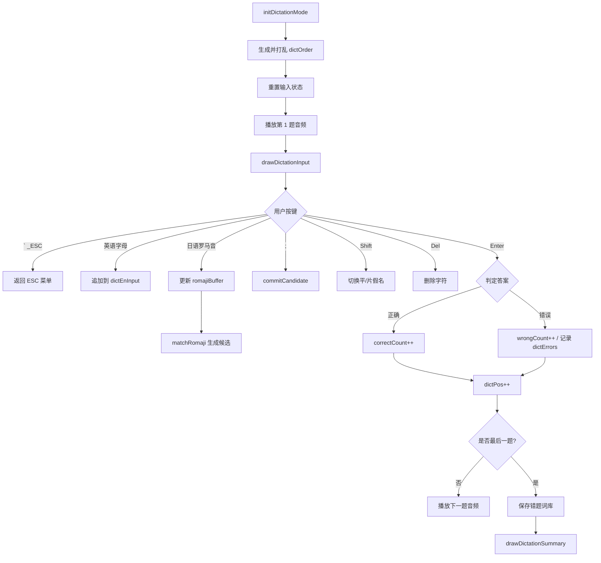

# ModeDictation.ino

> 最后更新日期: 2026/06/22

## 作用

`ModeDictation.ino` 实现 **听写测试模式**。系统按随机顺序播放单词发音，用户通过键盘输入答案；日语模式下使用内置罗马音→假名 IME，英语模式下直接输入字母。测试结束后展示正确/错误数量，并支持错题回顾与错题导出。

## 核心对象

| 对象 | 类型 | 说明 |
|------|------|------|
| `dictOrder` | `std::vector<int>` | 打乱后的单词索引序列 |
| `dictPos` | `int` | 当前题目在 `dictOrder` 中的位置 |
| `commitText` | `String` | 日语模式下已确认提交的假名 |
| `romajiBuffer` | `String` | 日语模式下当前罗马音缓冲 |
| `candidateKana` | `String` | 当前罗马音对应的候选假名 |
| `dictEnInput` | `String` | 英语模式下已输入的字母 |
| `useKatakana` | `bool` | 日语假名模式：平假名 / 片假名 |
| `dictErrors` | `std::vector<DictError>` | 错误记录 |
| `dictShowSummary` | `bool` | 是否显示总结界面 |
| `dictInReview` | `bool` | 是否处于错题回顾模式 |

## 关键流程

## 重要细节

### 英语输入

- 合法字符：`a-z`、`A-Z`、`0-9`、撇号 `'`、连字符 `-`、下划线 `_`、空格。
- 下划线 `_` 在提交时会被替换为空格。
- 答案比对前调用 `normalizeEnglishAnswer()`：去首尾空、转小写、下划线变空格、合并连续空格。

### 日语 IME

- **罗马音映射**：见 [UtilsIme.md](UtilsIme.md)，覆盖清音、浊音、半浊音、拗音、长音。
- **候选提交**：按 `;` 或 Enter 时，将 `candidateKana` 追加到 `commitText`。
- **促音检测**：当 `romajiBuffer` 长度为 1 且新输入字母与其相同，且为辅音 `k/s/t/p` 时，自动插入「っ/ッ」。
- **平/片假名切换**：按 Shift 切换 `useKatakana`，并重新计算当前候选。
- **删除优先级**：先删 `romajiBuffer` 末尾字母；缓冲区为空时删除 `commitText` 最后一个 UTF-8 字符。

### 测试结算

- 全部题目完成后自动调用 `saveDictationMistakesAsWordList()`，将错题保存到 `/words_study/<lang>/word/Mistake/原词库名(时间戳).json`。
- 总结界面按 Enter：无错题则返回 ESC 菜单，有错题则进入错题回顾。
- 错题回顾中：`,`/`/` 翻页，`Fn` 重播当前单词发音。

## 使用示例

### 日语听写

题目：`あめ`（糖果/下雨天）

1. 听到发音后输入 `a` → 屏幕显示 `a`，候选 `あ`。
2. 输入 `m` → 屏幕显示 `am`，候选为空（未匹配）。
3. 输入 `e` → 屏幕显示 `ame`，候选 `あめ`。
4. 按 **Enter** 提交，候选自动提交并判定正确。

### 英语听写

题目：`run`

1. 依次输入 `r`、`u`、`n`。
2. 按 **Enter** 提交，与标准答案比对。

## 注意事项

> ⚠️ **已修正**：旧文档写“英语听写暂未开放”，实际代码已完整支持英语听写。

- 日语 IME 目前为 Level 1 实现，不支持完整的变体输入（如 `shi` 之外也可用 `si`，但表中没有 `fu` 以外的替代拼写）。遇到无法输入的单词，可通过 `;` 强制提交当前候选。
- 错题本的文件名依赖 NTP 时间；若 WiFi 未连接，则使用 `millis()` 作为时间戳。
- 在错题回顾模式下按 `Enter` 不会返回，必须按 `ESC` 才能退出到菜单。
