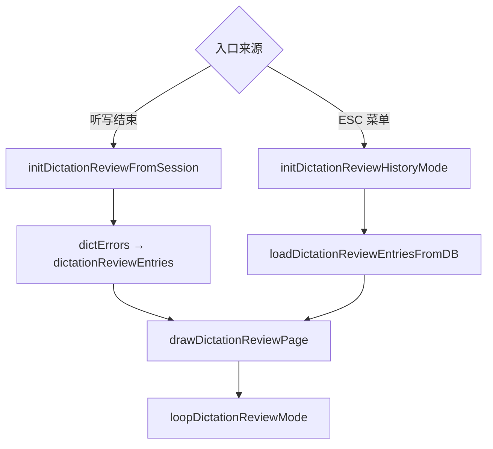
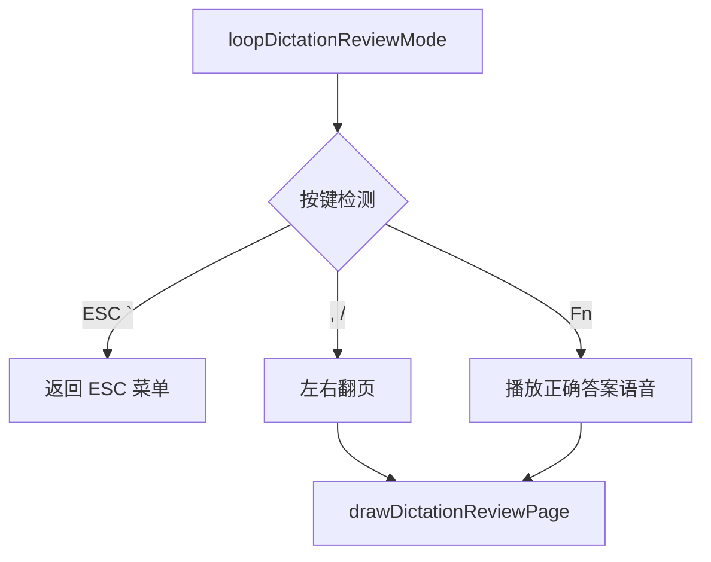

# ModeDictationReview.ino

> 最后更新日期: 2026/07/11

## 作用

`ModeDictationReview.ino` 实现**听写错误回顾页面**。支持两种入口：听写结束后查看本轮错题，以及从 ESC 菜单进入浏览当前语言下的历史错题。页面支持左右翻页和 Fn 重播正确答案语音。

## 核心对象

| 对象 | 类型 | 说明 |
|------|------|------|
| `DictationReviewEntry` | `struct` | 错题回顾条目：`wordDbId`、`correct`（正确答案）、`wrong`（错误输入）、`createdAt`（错误时间） |
| `dictationReviewEntries` | `std::vector<DictationReviewEntry>` | 当前回顾页的错题列表 |
| `dictationReviewIndex` | `int` | 当前正在查看的条目索引 |
| `dictationReviewTitle` | `String` | 页面标题（"本轮错题"或"历史错题"） |

## 核心函数

| 函数 | 作用 |
|------|------|
| `drawDictationReviewPage()` | 绘制错误回顾页面，显示正确答案/错误输入和页码 |
| `initDictationReviewFromSession()` | 用当前 dictErrors 初始化回顾页（听写结束入口） |
| `initDictationReviewHistoryMode()` | 从数据库加载历史错题初始化回顾页（ESC 菜单入口） |
| `loopDictationReviewMode()` | 独立错误回顾页主循环 |

## 关键流程

### 入口分发

### 主循环

## 重要细节

### 页面布局

- **标题**：左上角显示 `dictationReviewTitle`（"本轮错题"或"历史错题"）。
- **时间**：右上角显示 `createdAt`。
- **正确答案**：绿色大字，居中偏上。
- **错误输入**：红色大字，居中偏下。
- **页码**：底部居中显示 `当前/总数`。
- **空状态**：无错题时显示"没有错误记录"。

### 两种数据来源

| 来源 | 入口 | 数据 |
|------|------|------|
| 本轮错题 | 听写结束自动跳转 | 内存中的 `dictErrors` → `DictationReviewEntry` |
| 历史错题 | ESC 菜单 → "查看过往错题" | 数据库 `*_dictation_errors` 表 |

`initDictationReviewFromSession()` 直接将内存中的 `dictErrors` 转为页面条目，无需再次查询数据库，避免听写结束后额外开销。

## 使用示例

### 听写结束后回顾错题

1. 完成一轮听写测试，进入总结页面。
2. 按 Enter 进入错题回顾（若有错题）。
3. 按 `/` 查看下一个错题，按 `,` 回看上一个。
4. 按 `Fn` 重播当前正确答案的语音。
5. 按 `` ` ``（ESC）返回菜单。

### 从菜单浏览历史错题

1. 任意模式按 `` ` `` 呼出 ESC 菜单。
2. 按 `.` 高亮"查看过往错题"，按 Enter。
3. 页面加载历史错题列表，按 `,/` 翻页浏览。
4. 按 `` ` `` 返回菜单。

## 注意事项

- 若无错题记录，页面显示空状态提示，`,` `/` `Fn` 键均无效果。
- 历史错题从数据库加载，若加载失败会显示"错题加载失败"并返回空列表。
- `initDictationReviewFromSession()` 会跳过 `wordIndex` 越界的错题条目。
