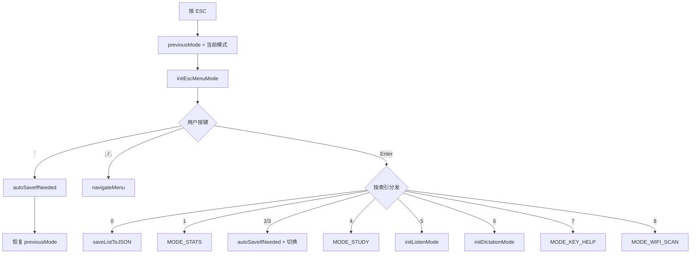

# ModeEscMenu.ino

> 最后更新日期: 2026/06/22

## 作用

`ModeEscMenu.ino` 实现应用程序的 **全局 ESC 菜单**。用户在学习、听读、听写等模式中按 `` ` ``（ESC）键即可呼出，提供保存进度、切换模式、重新选择词库/语言、查看统计、连接 WiFi 等入口。

## 核心对象

| 对象 | 类型 | 说明 |
|------|------|------|
| `escItems` | `std::vector<String>` | 9 个菜单项 |
| `escIndex` | `int` | 当前选中索引 |
| `escScoll` | `int` | 滚动偏移 |
| `previousMode` | `AppMode` | 进入菜单前的模式，退出时恢复 |

## 菜单项索引

| 索引 | 菜单项 | 动作 |
|------|--------|------|
| 0 | 保存进度 | 调用 `saveListToJSON` 写回 SD 卡 |
| 1 | 学习统计 | 进入 `MODE_STATS` |
| 2 | 重新选择词库 | 自动保存后进入 `MODE_FILE_SELECT` |
| 3 | 重新选择语言 | 自动保存后进入 `MODE_LANG_SELECT` |
| 4 | 进入学习模式 | 进入 `MODE_STUDY` |
| 5 | 进入听读模式 | 进入 `MODE_LISTEN` |
| 6 | 进入听写模式 | 进入 `MODE_DICTATION` |
| 7 | 按键帮助 | 进入 `MODE_KEY_HELP` |
| 8 | WiFi 连接 | 进入 `MODE_WIFI_SCAN` |

## 关键流程

## 重要细节

- **退出菜单**：再次按 `` ` `` 时，会先触发 `autoSaveIfNeeded()`，然后恢复到 `previousMode`。
  - 若上一模式是学习模式，直接重绘当前闪卡。
  - 若上一模式是听读或听写，会重新初始化该模式（避免状态错乱）。
- **保存进度**：手动保存后会显示“保存成功！”或“保存失败！”提示，然后仍停留在菜单。
- **切换词库/语言**：在跳转前自动保存当前词库进度，防止丢失。

## 使用示例

### 保存并切换模式

1. 学习模式中按 `` ` `` 呼出菜单。
2. 按 `.` 高亮“保存进度”，按 Enter 保存。
3. 按 `.` 高亮“进入听写模式”，按 Enter 开始听写。
4. 听写中再按 `` ` `` 可返回菜单，再按 `` ` `` 回到听写。

## 注意事项

- `escScoll` 变量命名故意简写，实际作用与 `fileScroll` 等一致。
- 从菜单进入学习模式时不会重新初始化 `wordIndex`，因此会回到之前学习的单词；进入听读/听写会重新初始化。
- 菜单列表超过 4 项时，`drawTextMenu()` 会自动分页显示。
