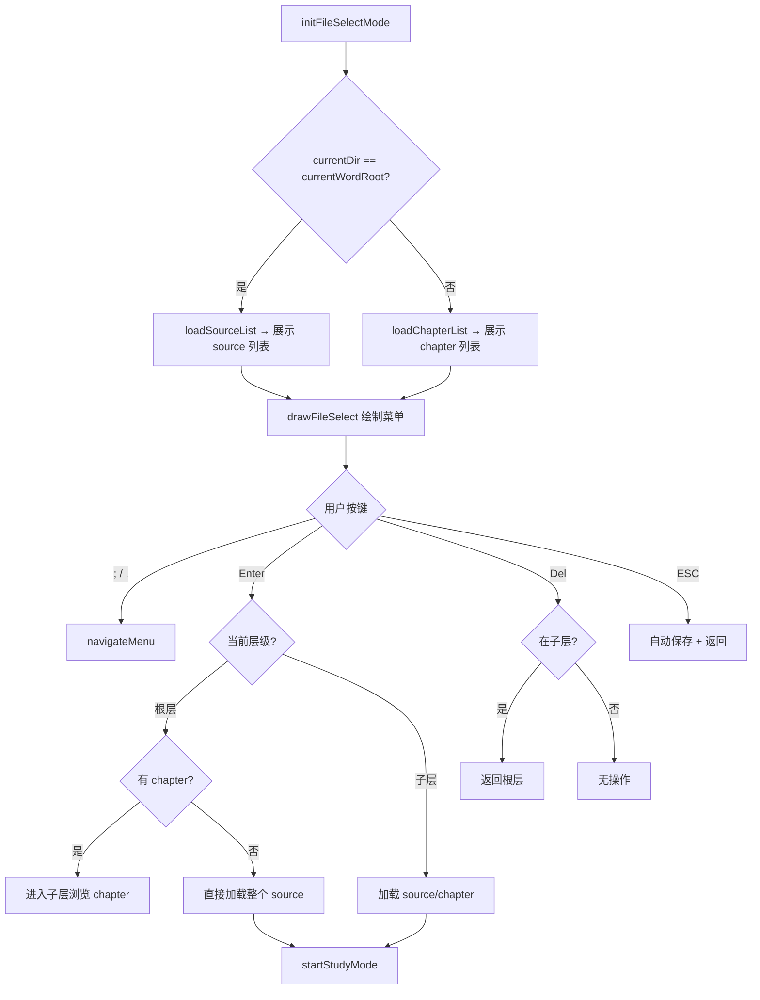

# ModeFileSelect.ino

> 最后更新日期: 2026/07/11

## 作用

`ModeFileSelect.ino` 实现**词库浏览器**。已在底层改为数据库驱动，不再直接浏览 SD 卡 JSON 文件。用户在选择语言后进入该模式，浏览 SQLite 数据库中的 source（词源）和 chapter（章节），选中后加载并进入学习模式。

## 核心对象

| 对象 | 类型 | 说明 |
|------|------|------|
| `files` | `std::vector<String>` | 当前层级下的 source 或 chapter 列表 |
| `fileIndex` | `int` | 当前选中索引 |
| `fileScroll` | `int` | 当前滚动偏移 |
| `currentDir` | `String` | 虚拟目录，用于区分根层（source）和子层（chapter） |
| `selectedSource` | `String` | 选中的词库来源 |
| `selectedChapter` | `String` | 选中的章节，空表示整个 source |
| `selectedFilePath` | `String` | 显示标签（如 `Demo_Basics/Unit_1`） |

## 关键流程

## 重要细节

### 虚拟目录系统

`currentDir` 不再指向 SD 卡真实路径，而是逻辑路径：
- **根层**（`currentDir == currentWordRoot`）：显示所有 source 列表
- **子层**（`currentDir == currentWordRoot/<source>`）：显示该 source 的 chapter 列表

根据 `sourceHasChapters()` 判断 source 是否有子划分。无 chapter 的 source 直接加载。

### 词库加载

选中词库后通过 `startStudyMode()` 加载：
- 设置 `selectedSource` 和 `selectedChapter`
- 调用 `loadWordsFromDB()` 从数据库加载
- 自动保存上一词库的进度

## 使用示例

### 浏览并加载词库

1. 选择语言后进入 root 层，看到所有 source 列表（如 `Demo_Basics`、`N5`）。
2. 按 `;/.` 上下移动，Enter 选中。
3. 若 source 有 chapter，进入子层浏览章节（如 `Unit_1`、`Unit_2`）。
4. 选中 chapter 后开始学习。
5. 在子层按 Del 返回根层。

## 注意事项

- `selectedFilePath` 变量名保留旧命名，但现在只作为 UI 显示标签使用。
- 真实的数据加载依据是 `selectedSource` 和 `selectedChapter`。
- 空列表时显示"没有词库数据"提示。
- 从文件选择切换词库时，`startStudyMode()` 会先自动保存旧词库进度。
