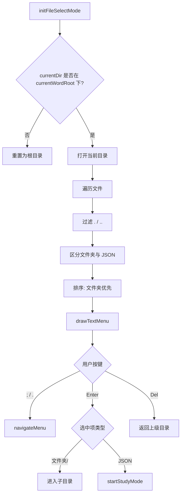

# ModeFileSelect.ino

> 最后更新日期: 2026/06/22

## 作用

`ModeFileSelect.ino` 实现 **SD 卡词库文件浏览器**。用户在选择语言后进入该模式，浏览 `/words_study/<lang>/word` 下的子目录与 JSON 词库文件，选中后加载并进入学习模式。

## 核心对象

| 对象 | 类型 | 说明 |
|------|------|------|
| `files` | `std::vector<String>` | 当前目录下的文件/文件夹列表 |
| `fileIndex` | `int` | 当前选中索引 |
| `fileScroll` | `int` | 当前滚动偏移 |
| `currentDir` | `String` | 文件浏览器当前目录 |

## 关键流程



## 重要细节

- **列表排序规则**：
  - 文件夹排在文件前面。
  - 同类型按字母顺序升序排列。
- **目录保护**：`Del` 返回上级目录时，若当前已在 `currentWordRoot` 则不再回退，避免跳出词库根目录。
- **文件过滤**：只识别 `.json` 文件；文件夹以 `/` 后缀标识。
- **空目录处理**：若 `files` 为空，直接显示“无词库文件”提示并忽略后续输入。

## 使用示例

### 浏览并选择词库

假设目录结构为：

```
/words_study/en/word/
├── basics/
│   └── day_01.json
├── travel/
│   └── airport.json
└── review.json
```

1. 进入文件选择后看到：
   ```
   > basics/
     travel/
     review.json
   ```
2. 按 `.` 移动到 `basics/`，按 Enter 进入。
3. 按 `.` 选中 `day_01.json`，按 Enter 开始学习。
4. 按 Del 可返回上级目录。

## 注意事项

- 选择 JSON 文件后，会调用 `startStudyMode()`，该函数会先 `autoSaveIfNeeded()` 保存上一个词库的进度，再加载新词库。
- 文件列表不会递归显示子目录内容，必须一层层进入。
