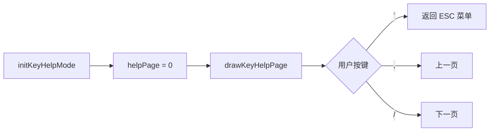

# ModeKeyHelp.ino

> 最后更新日期: 2026/06/22

## 作用

`ModeKeyHelp.ino` 实现 **按键帮助页面**。以三页表格形式展示通用操作、学习模式操作、听写模式操作的按键说明，帮助用户快速查阅设备交互方式。

## 核心对象

| 对象 | 类型 | 说明 |
|------|------|------|
| `helpTotalPages` | `const int` | 总页数：3 |
| `helpTitles[]` | `const char*` | 页面标题：`{"通用", "学习模式", "听写模式"}` |
| `helpPage0` | `vector<vector<String>>` | 通用按键说明 |
| `helpPage1` | `vector<vector<String>>` | 学习模式按键说明 |
| `helpPage2` | `vector<vector<String>>` | 听写模式按键说明 |
| `helpPage` | `int` | 当前页码 |

## 帮助内容

### 通用

| 按键 | 功能 |
|------|------|
| ESC（`） | 打开/关闭菜单 |
| `;` / `.` | 音量加/减 |
| `Fn` | 播放发音 |
| `,` / `/` | 翻页（左/右） |

### 学习模式

| 按键 | 功能 |
|------|------|
| BtnA | 显示/隐藏释义 |
| Enter | 记住（score +1） |
| Del | 不熟（score -1） |

### 听写模式

| 按键 | 功能 |
|------|------|
| 字母键 | 输入答案 |
| Enter | 提交答案 |
| Del | 删除字符 |
| Shift | 平/片假名切换 |
| `;` | 确认当前假名 |

## 关键流程

## 重要细节

- 页面使用 `drawSimpleTable()` 渲染，表头为“按键”和“功能”。
- 页码显示在右上角，格式为 `1/3`、`2/3`、`3/3`。
- 翻页是循环的：第 1 页按 `,` 会跳到第 3 页。

## 使用示例

1. 在 ESC 菜单中选择“按键帮助”。
2. 按 `,`/`/` 翻页查看不同场景下的按键说明。
3. 按 `` ` `` 返回菜单。

## 注意事项

- 帮助页面仅展示静态文本，不会触发任何数据修改或音频播放。
- 若后续新增模式或修改按键映射，需同步更新 `helpPage1` / `helpPage2` 中的内容。
