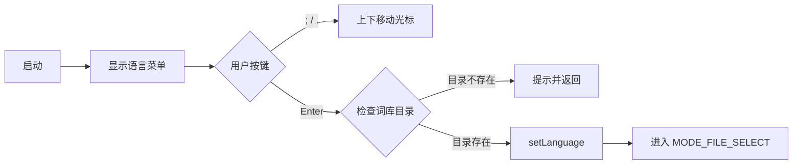

# ModeLangSelect.ino

> 最后更新日期: 2026/06/22

## 作用

`ModeLangSelect.ino` 实现设备启动后的**语言选择模式**。用户通过方向键在“日语”与“英语”之间切换并按 Enter 确认，系统随后绑定对应的词库根目录与音频根目录，并进入文件选择模式。

## 核心对象

| 对象 | 类型 | 说明 |
|------|------|------|
| `langItems` | `std::vector<String>` | 菜单项：`{"日语", "英语"}` |
| `langIndex` | `int` | 当前高亮索引 |

## 关键流程

## 重要细节

- **路径绑定**：确认选择后调用 `setLanguage()`，该函数在 `UtilsData.ino` 中实现，会同步更新：
  - `currentWordRoot`
  - `currentAudioRoot`
  - `currentDir`
  - 并清空 `selectedFilePath` 与 `words`。
- **目录校验**：Enter 确认前会先检查 `/words_study/jp` 或 `/words_study/en` 是否存在；不存在时屏幕提示“未找到词库文件夹”并保持在语言选择界面。
- **菜单渲染**：直接复用 `drawTextMenu()`，不显示电量与分页指示器（`showBattery=false, showPager=false`）。

## 使用示例

### 用户操作流程

1. 开机后看到 `> 日语` 与 `英语`。
2. 按 `.` 切换到 `> 英语`（按 `;` 回到日语）。
3. 按 Enter 确认。
4. 若 SD 卡 `/words_study/en` 存在，立即进入文件选择界面。

## 注意事项

- 旧文档中 `langItems` 被描述为带英文括号版本（如 "日语 (Japanese)"），实际代码只使用中文 `{"日语", "英语"}`。
- 切换语言会清空已加载的 `words`，因此只有在启动时或从 ESC 菜单“重新选择语言”才会执行；学习过程中切换语言前会先触发 `autoSaveIfNeeded()`。
