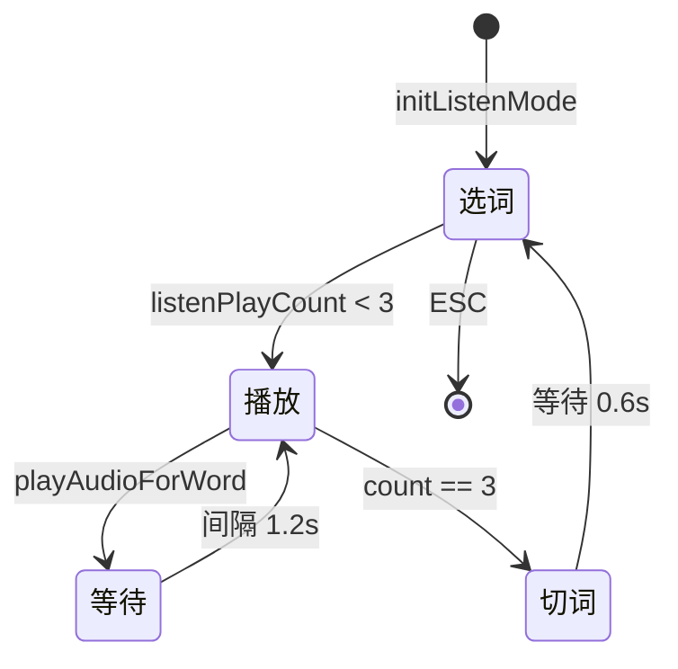

# ModeListen.ino

> 最后更新日期: 2026/06/22

## 作用

`ModeListen.ino` 实现 **听读模式**（磨耳朵模式）。系统按加权随机顺序自动抽取单词，每个单词循环播放 3 次发音，并在屏幕上同步显示单词文本、注音与中文释义，适合免提场景。

## 核心对象

| 对象 | 类型 | 说明 |
|------|------|------|
| `listenPlayCount` | `int` | 当前单词已播放次数（0~3） |
| `listenNextActionTime` | `unsigned long` | 下一次动作的时间戳 |
| `listenRepeatInterval` | `const 1200` ms | 同一单词两次播放间隔 |
| `listenNextWordDelay` | `const 600` ms | 播完 3 次后切换单词前的等待 |

## 关键流程

## 重要细节

- **播放状态机**：基于 `millis()` 的非阻塞控制。
  1. `listenPlayCount < 3` 且扬声器空闲 → 播放一次，计数 +1，设置下次动作时间为 `now + 1200`。
  2. `listenPlayCount == 3` 且扬声器空闲 → 加权随机选下一个单词，计数归零，设置 `now + 600`。
- **加权选词**：使用 `pickWeightedRandom()`，低熟练度单词出现概率更高。
- **界面显示**：
  - 英语：显示 `en` + `phonetic` + `pos`。
  - 日语：显示 `jp` + `kanji`。
  - 统一在下方显示 `zh`。
- **交互**：仅支持 `ESC` 返回菜单、`;`/`.` 调整音量。其他按键不影响播放流程。

## 使用示例

1. 从 ESC 菜单选择“进入听读模式”。
2. 屏幕显示当前单词与释义，扬声器自动播放发音。
3. 同一单词播放 3 次后自动切换下一个单词。
4. 按 `ESC` 可随时退出到 ESC 菜单。

## 注意事项

> ⚠️ **已修正**：旧文档写“英语听读暂未支持”，实际代码已同时支持日语和英语。

- 听读模式依赖 `M5.Speaker.isPlaying()` 判断是否可以播放下一个音频，因此不要在后台运行其他占用扬声器的任务。
- 若词库为空，`initListenMode()` 会显示“请先加载词库”并直接返回。
- 切词时的 600 ms 等待让用户有时间看清屏幕内容，避免频繁刷新。
