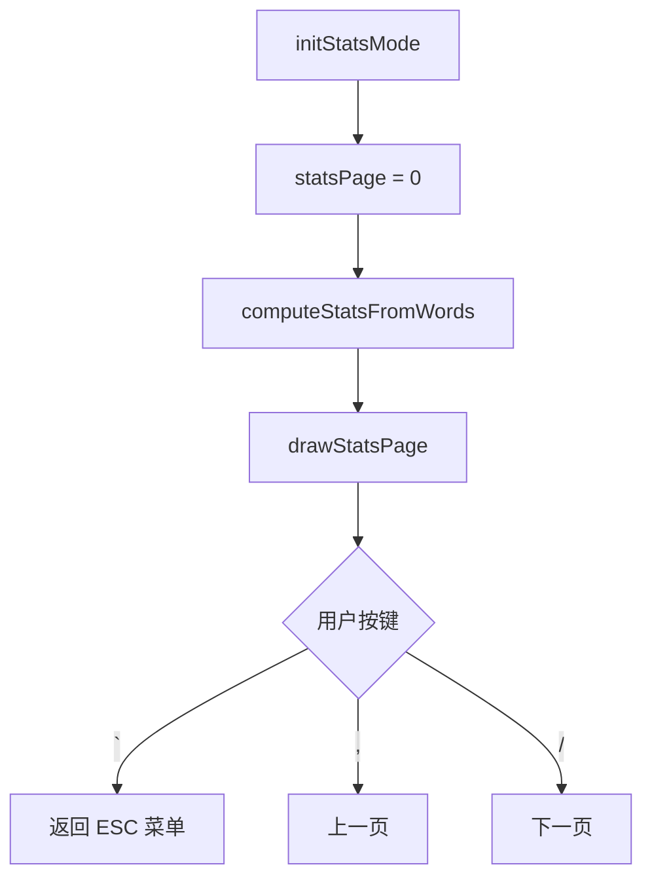

# ModeStats.ino

> 最后更新日期: 2026/06/22

## 作用

`ModeStats.ino` 实现 **学习统计模式**。对当前已加载词库的 `score` 分布进行统计，并以三页报表展示：概览、低等级分布（1-3）、高等级分布（4-5）。

## 核心对象

| 对象 | 类型 | 说明 |
|------|------|------|
| `statsTotal` | `int` | 单词总数 |
| `statsAvg` | `float` | 平均分 |
| `statsMedian` | `float` | 中位数 |
| `statsCounts[6]` | `int[]` | 各 score 等级计数，索引 1~5 有效 |
| `statsLevel` | `String` | 掌握评价文字 |
| `statsPage` | `int` | 当前页码 0/1/2 |

## 关键流程

## 重要细节

### 统计计算

- **平均分**：所有 `score` 求和除以总数。
- **中位数**：分数排序后取中间值；偶数个时取中间两数平均。
- **评价等级**：

| 平均分范围 | 评价 | 颜色 |
|-----------|------|------|
| ≥ 4.5 | 非常熟练 | 绿色 |
| ≥ 3.8 | 较为熟练 | 青色 |
| ≥ 3.0 | 掌握中 | 黄色 |
| ≥ 2.0 | 不牢固 | 橙色 |
| < 2.0 | 需要重点复习 | 红色 |

### 页面内容

| 页码 | 内容 |
|------|------|
| 0 | 词库文件名、总数、平均分、中位数、评价 |
| 1 | 等级 1/2/3 的数量与占比表格 |
| 2 | 等级 4/5 的数量与占比表格 |

- 百分比四舍五入到整数。
- 表格使用 `drawSimpleTable()` 渲染。

## 使用示例

1. 在学习过程中按 `ESC` 进入菜单。
2. 选择“学习统计”。
3. 第 1 页查看平均分与总体评价。
4. 按 `/` 翻页查看各等级分布。
5. 按 `ESC` 返回菜单。

## 注意事项

- 统计直接读取内存中的 `words` 数组；若未加载词库，`statsTotal == 0`，屏幕显示“请先加载词库”。
- `computeStatsFromWords()` 同时被 `UtilsWebServer.ino` 的 `/api/stats` 调用，计算逻辑需保持一致。
- 分数非法值（<1 或 >5）在统计时会被按 3 处理。
