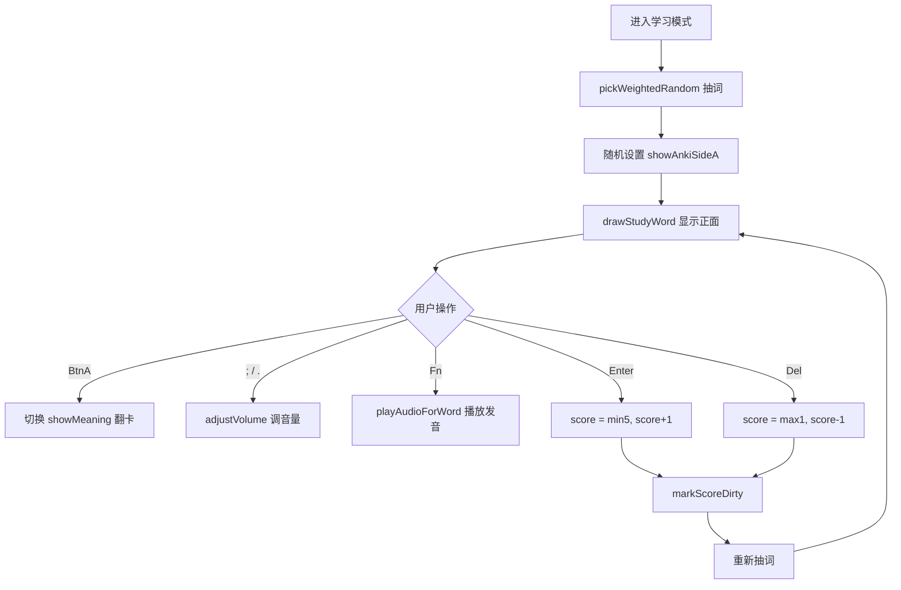

# ModeStudy.ino

> 最后更新日期: 2026/06/22

## 作用

`ModeStudy.ino` 实现 **Anki 风格的双面闪卡学习模式**。每次抽取一个单词，随机决定先显示外语（Side A）还是中文释义（Side B），用户通过翻卡、打分、播放音频来强化记忆。

## 核心对象

| 对象 | 类型 | 说明 |
|------|------|------|
| `showMeaning` | `bool` | 是否已翻卡显示释义/原文 |
| `showAnkiSideA` | `bool` | `true`=先显示外语，`false`=先显示中文 |
| `wordIndex` | `int` | 当前学习的单词在 `words` 中的索引 |

## 关键流程

## 重要细节

### Side A / Side B 显示内容

| 语言 | Side A（外语优先） | Side B（中文优先） |
|------|-------------------|-------------------|
| 英语 | 主显 `en` + `phonetic`（IPA 转 ASCII） | 主显 `zh` + `pos`，翻卡后显示 `en` |
| 日语 | 主显 `jp` + `tone` | 主显 `zh` + `kanji`，翻卡后显示 `jp` |

- **随机翻面**：每次评分后，`showAnkiSideA = random(2)`，实现双向回忆训练。
- **分数边界**：`Enter` 最多加至 5，`Del` 最少减至 1。
- **自动保存**：每次评分调用 `markScoreDirty()`，累计 5 次后自动回写 SD 卡。
- **首次进入英语**：`startStudyMode()` 会强制 `showAnkiSideA = true`，避免空中文优先时无法显示内容。

## 使用示例

### 学习一个单词

1. 屏幕显示 `apple` 与音标 `/ˈæpəl/`。
2. 想不起来时按 **BtnA** 翻卡，显示中文“苹果”。
3. 按 **Enter** 标记“记住”，分数 +1，系统抽取下一个单词。
4. 若记错了，按 **Del** 标记“不熟”，分数 -1。
5. 随时按 **Fn** 重听发音，按 **;** / **.** 调整音量。

## 注意事项

> ⚠️ **已修正**：旧文档写“`Enter`/`Space` 翻卡、`1-5` 打分”，与实际代码严重不符。实际交互为 **BtnA 翻卡**、**Enter 记住**、**Del 不熟**。

- 进入学习模式前必须已通过文件选择加载词库，否则 `words.empty()` 会显示“未找到单词数据”。
- 评分后立即重新抽词，不会停留在当前单词查看结果，因此建议在翻卡确认后再打分。
- 右上角仅在音量调节后 2 秒内显示当前音量值。
