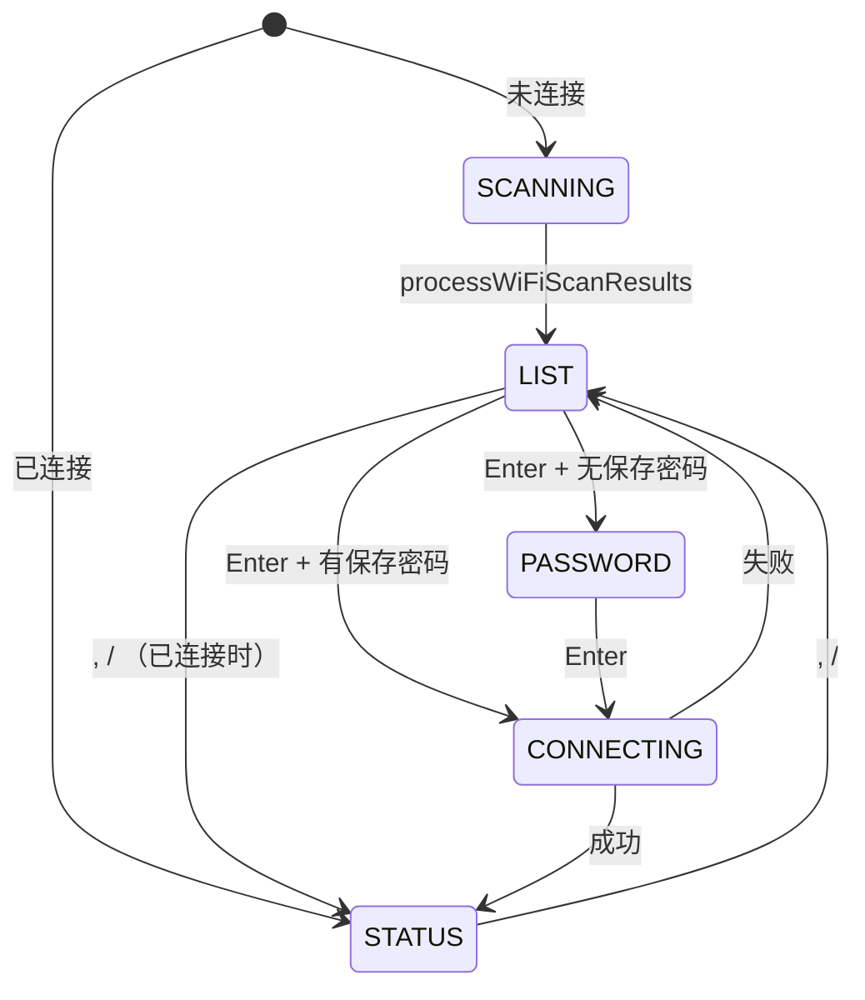

# ModeWiFiScan.ino

> 最后更新日期: 2026/06/22

## 作用

`ModeWiFiScan.ino` 实现 **WiFi 扫描与连接模式**。扫描附近 WiFi 网络，用户选择 SSID 后输入密码并尝试连接；已保存的 SSID 可直接免密连接。连接成功后启动 Web 控制台并同步 NTP 时间。

## 核心对象

| 对象 | 类型 | 说明 |
|------|------|------|
| `WiFiScanState` | `enum` | `WIFI_SCANNING` / `WIFI_LIST` / `WIFI_PASSWORD` / `WIFI_CONNECTING` |
| `wifiScanState` | `WiFiScanState` | 当前子状态 |
| `wifiSSIDs` | `std::vector<String>` | 显示用网络列表（含信号指示） |
| `wifiRawSSIDs` | `std::vector<String>` | 纯 SSID 列表 |
| `wifiListIndex` | `int` | 列表选中索引 |
| `wifiPasswordInput` | `String` | 密码输入框内容 |
| `wifiSelectedSSID` | `String` | 当前选中的 SSID |
| `wifiPage` | `int` | 0=列表页，1=状态页（仅连接后可用） |

## 关键流程

## 重要细节

### 扫描结果处理

- 去重：同名 SSID 保留信号最强的一条。
- 排序：按 RSSI 从高到低排列。
- 标记：已保存密码的 SSID 前显示 `★`。
- 信号指示：`[###]`（强 > -50 dBm）、`[## ]`（中 > -70 dBm）、`[#  ]`（弱）。

### 连接流程

1. 选择 SSID 后，若已保存密码则自动填充并尝试连接。
2. 若未保存密码，进入密码输入覆盖层。
3. 密码输入支持可打印 ASCII 字符（` ` ~ `~`），按 Del 删除。
4. 按 Enter 调用 `attemptWiFiConnect()`，超时 10 秒。
5. 连接成功后：
   - 设置 `wifiConnected = true`
   - 同步 NTP（UTC+8）
   - 启用 `WIFI_PS_MIN_MODEM` 省电
   - 保存凭据到 `/words_study/wifi.json`
   - 启动 Web 服务器

### 已连接状态

- 再次进入 WiFi 模式时直接显示状态页（IP、SSID、Web 控制台状态）。
- 此时按 `,`/`/` 可在列表页与状态页之间切换。

## 使用示例

### 首次连接 WiFi

1. 在 ESC 菜单中选择“WiFi 连接”。
2. 等待扫描完成，列表显示附近网络。
3. 按 `.` 选择目标网络，按 Enter。
4. 输入密码（屏幕显示星号），按 Enter 连接。
5. 连接成功后显示 IP 地址，Web 控制台自动启动。

### 已保存网络直连

1. 扫描列表中已保存网络显示 `★`。
2. 选中后按 Enter，直接使用保存密码连接，无需再次输入。

## 注意事项

- 密码输入界面按 `` ` `` 返回网络列表，不会保存已输入的字符。
- 连接失败会显示错误码（`WiFi.status()`）1.5 秒后返回列表。
- WiFi 连接成功后启用 Modem Sleep，Web 服务器响应可能略有延迟，但可显著降低功耗。
- 状态页仅在 `wifiConnected == true` 时可翻到；未连接时 `,`/`/` 按键无效。
