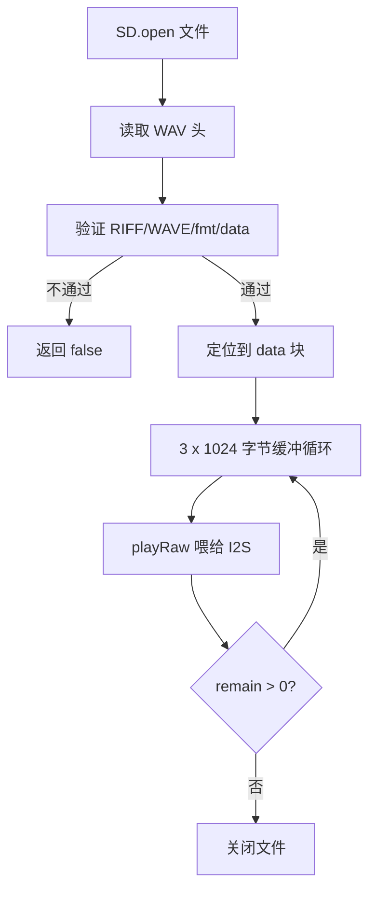

# UtilsAudio.ino

> 最后更新日期: 2026/06/22

## 作用

`UtilsAudio.ino` 是项目的 **音频播放引擎**。负责音量调节、从 SD 卡流式读取 WAV 文件并通过 M5Cardputer 扬声器播放，同时提供按单词名查找音频的便捷接口。

## 核心函数

| 函数 | 作用 |
|------|------|
| `adjustVolume(c)` | 根据 `;` / `.` 调整全局音量并显示 HUD |
| `playWavStream(path)` | 流式解析并播放 WAV 文件 |
| `playAudioForWord(word)` | 按单词名拼接路径并播放音频 |

## 关键流程

### 音量调节


### WAV 流式播放



## 重要细节

### WAV 格式支持

| 参数 | 支持值 |
|------|--------|
| 编码 | PCM（audiofmt == 1） |
| 位深 | 8-bit 或 16-bit |
| 声道 | 单声道或立体声 |
| 采样率 | 任意（由文件头决定） |

- 不支持 MP3、AAC 等压缩格式。
- 文件头中 `fmt ` 块之后可能跟随其他 chunk（如 `LIST`），代码会跳过非 `data` chunk。

### 音频路径规则

```
/words_study/<lang>/audio/<word>.wav
```

- 日语：`/words_study/jp/audio/あめ.wav`
- 英语：`/words_study/en/audio/apple.wav`

### 容错反馈

| 场景 | 行为 |
|------|------|
| 文件不存在 | 串口打印 + 880Hz 提示音 |
| 正在播放其他音频 | 等待并停止后再播放 |
| WAV 解析失败 | 440Hz 警告音 |

## 使用示例

### 播放当前学习单词

```cpp
if (currentLanguage == LANG_JP) {
    playAudioForWord(words[wordIndex].jp);
} else {
    playAudioForWord(words[wordIndex].en);
}
```

### 直接播放指定 WAV

```cpp
playWavStream("/words_study/en/audio/custom.wav");
```

## 注意事项

- `playAudioForWord()` 在播放前会阻塞等待当前音频结束，避免重叠；因此不适合在需要低延迟的场景调用。
- 三重缓冲（3×1024 字节）可降低内存占用，但播放高采样率长音频时仍可能出现短暂卡顿，建议使用 16kHz 单声道 16-bit。
- `playRaw` 的 `repeat=1` 参数来自 M5Stack 官方 demo，表示该缓冲块播放 1 次，不要误以为是循环播放。
