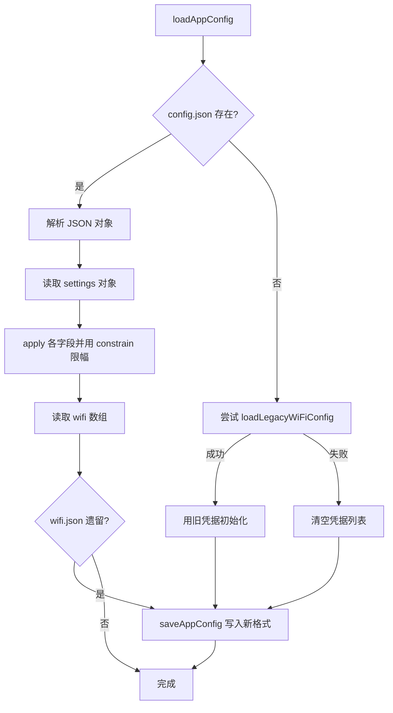

# UtilsConfig.ino

> 最后更新日期: 2026/07/11

## 作用

`UtilsConfig.ino` 负责**设备配置的持久化管理**。统一管理 SD 卡上的 `/words_study/config.json`，包括 WiFi 凭据列表、音量与亮度、默认语言、自动保存阈值、自动熄屏超时与暗屏亮度。同时兼容旧版 `/words_study/wifi.json`，首次读取时会自动迁移并清理旧文件。

## 核心对象

| 对象 | 类型 | 说明 |
|------|------|------|
| `kConfigFilePath` | `const char*` | 配置文件路径：`/words_study/config.json` |

## 核心函数

| 函数 | 作用 |
|------|------|
| `loadAppConfig()` | 从 `config.json` 加载配置，兼容旧版 `wifi.json` 迁移 |
| `saveAppConfig()` | 将当前所有配置写回 `config.json` |
| `loadWiFiArray(arr)` | 从 JSON 数组读取 WiFi 凭据到 `savedWiFiList` |
| `loadLegacyWiFiConfig()` | 读取旧版 `wifi.json` 并迁移到内存结构 |

## 配置 JSON 结构

```json
{
  "version": 1,
  "settings": {
    "volume": 192,
    "language": "jp",
    "brightness": 200,
    "dim_brightness": 40,
    "idle_timeout_ms": 60000,
    "auto_save_threshold": 5
  },
  "wifi": [
    { "ssid": "MyHome", "pass": "password123" }
  ]
}
```

| 字段 | 类型 | 范围 | 说明 |
|------|------|------|------|
| `version` | int | 1 | 配置格式版本号 |
| `settings.volume` | int | 0~255 | 扬声器音量 |
| `settings.language` | string | `"jp"` / `"en"` | 默认学习语言 |
| `settings.brightness` | int | 10~255 | 正常屏幕亮度 |
| `settings.dim_brightness` | int | 1~255 | 省电模式亮度 |
| `settings.idle_timeout_ms` | int | ≥1000 | 无操作超时（毫秒） |
| `settings.auto_save_threshold` | int | ≥1 | 自动保存触发次数 |
| `wifi` | array | - | WiFi 凭据列表 |

## 关键流程

### 配置加载流程



### 旧版迁移

当设备首次升级到新配置系统时，`loadAppConfig()` 会：

1. 尝试读取旧版 `/words_study/wifi.json`。
2. 将旧凭据迁移到内存 `savedWiFiList`。
3. 调用 `saveAppConfig()` 写入统一格式的 `config.json`。
4. **自动删除** `/words_study/wifi.json`，避免配置分叉。

## 重要细节

- **值域保护**：所有读取的配置值都经过 `constrain()` / `max()` 限幅，防止非法值导致异常行为。
- **暗屏亮度钳位**：`dimBrightness` 被强制不超过 `normalBrightness`。
- **原子写入**：保存时先 `SD.remove()` 旧配置文件，再写入新内容。
- **旧文件清理**：`saveAppConfig()` 写入成功后会自动删除 `wifi.json`（若存在）。

## 使用示例

### 修改自动保存阈值

```cpp
autoSaveThreshold = 10;  // 改为每 10 次评分自动保存
saveAppConfig();         // 持久化到 SD 卡
```

### 读取配置

```cpp
loadAppConfig();                        // 加载或迁移配置
setLanguage(currentLanguage);           // 同步语言
M5.Speaker.setVolume(soundVolume);      // 同步音量
```

## 注意事项

- 配置文件通过 `DynamicJsonDocument(8192)` 解析，总大小不超过 8KB。
- 旧版 `wifi.json` 迁移是单向操作，迁移后旧文件会被删除。
- 若 `config.json` 解析失败且无旧版文件，所有配置使用代码中的默认值并写入新配置文件。
