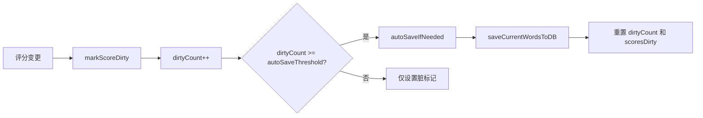

# UtilsData.ino

> 最后更新日期: 2026/07/11

## 作用

`UtilsData.ino` 是项目的**运行时词库数据与学习状态管理模块**。负责管理设备内存中的词库状态与学习流程，包括基于熟练度的加权随机抽词、score 脏标记与自动保存触发、学习统计计算、语言切换后的状态重置。与 SQLite 的直接交互已拆分到 [UtilsDb.ino](UtilsDb.md)。

## 核心函数

| 函数 | 作用 |
|------|------|
| `pickWeightedRandom()` | 基于熟练度的加权随机抽词（不熟悉的词更常出现） |
| `markScoreDirty()` | 标记 score 已变更，累计至 `autoSaveThreshold` 时触发自动保存 |
| `autoSaveIfNeeded()` | 若存在未保存变更，调用 `saveCurrentWordsToDB()` 写回数据库 |
| `setLanguage(lang)` | 切换语言并更新词库/音频根目录，重置已选 source/chapter |
| `startStudyMode()` | 自动保存旧进度、加载当前词库、抽取首词 |
| `dictationPromptText(w)` | 获取当前语言下用于听写的文本（`en` 或 `jp`） |
| `computeStatsFromWords()` | 计算平均分、中位数、等级分布与掌握程度评价 |
| `statsFileName(path)` | 从路径中提取显示用名称 |

## 关键流程

### 加权随机抽词

- 权重公式：`weight = 6 - score`
- score=1 的单词权重为 5，score=5 的单词权重为 1。
- 计算总权重后生成随机数，按累计权重确定选中索引。
- 让不熟悉的单词更频繁出现，已熟练掌握的单词自然淡出。

### 自动保存机制



### 统计计算

```mermaid
flowchart TD
    A[computeStatsFromWords] --> B{words 为空?}
    B -->|是| C[statsLevel = "词库为空"]
    B -->|否| D[遍历所有单词]
    D --> E[统计各等级数量]
    E --> F[计算平均分 + 中位数]
    F --> G{statsAvg 范围}
    G -->|≥ 4.5| H["非常熟练"]
    G -->|≥ 3.8| I["较为熟练"]
    G -->|≥ 3.0| J["掌握中"]
    G -->|≥ 2.0| K["不牢固"]
    G -->|< 2.0| L["需要重点复习"]
```

## 重要细节

### 语言切换

`setLanguage()` 切换语言时执行：
- 更新 `currentWordRoot` / `currentAudioRoot` 路径
- 重置 `currentDir`、`selectedSource`、`selectedChapter`
- 清空 `words` 列表和 `wordIndex`
- Web API 浏览列表随之更新

### score 规范化

`computeStatsFromWords()` 中 score 超出 1~5 范围时默认按 3 处理。正常 score 值由数据库层的 `normalizeScoreValue()` 保证在合法范围内。

### statsFileName

由于迁移到数据库后 `selectedFilePath` 不再是真实文件路径，`statsFileName()` 通过截取最后一段 `/` 后的文本作为显示名，供统计页和 Web 面板使用。

## 使用示例

### 手动触发保存

```cpp
markScoreDirty();  // 标记变更，累计达到阈值后自动保存
// 或者直接调用：
autoSaveIfNeeded();
```

### 切换语言

```cpp
setLanguage(LANG_EN);  // 自动更新路径并清空当前词库状态
```

### 计算统计

```cpp
computeStatsFromWords();
Serial.printf("平均分: %.2f, 中位数: %.1f, 评价: %s\n",
    statsAvg, statsMedian, statsLevel.c_str());
```

## 注意事项

- 词库加载（`loadWordsFromDB()`）和保存（`saveCurrentWordsToDB()`）已移至 [UtilsDb.ino](UtilsDb.md)，本模块仅负责内存中的运行时逻辑。
- `autoSaveIfNeeded()` 在 `selectedSource.isEmpty()` 或 `words.empty()` 时直接返回，避免空操作。
- `startStudyMode()` 内部已包含 `autoSaveIfNeeded()`，因此从文件选择切换词库时无需额外保存。
