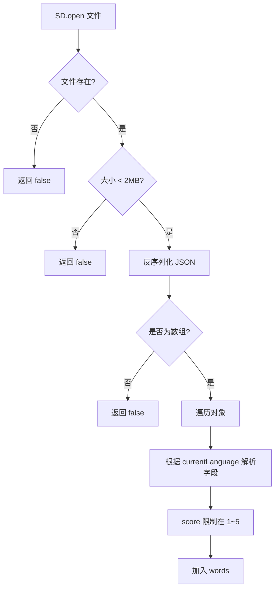
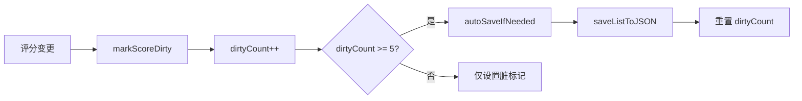

# UtilsData.ino

> 最后更新日期: 2026/06/22

## 作用

`UtilsData.ino` 是项目的 **数据持久化与词库管理工具**。负责从 SD 卡加载/保存 JSON 词库、实现基于熟练度的加权随机抽词、学习进度自动保存、听写错题导出以及语言路径切换。

## 核心函数

| 函数 | 作用 |
|------|------|
| `loadWordsFromJSON(path)` | 从 SD 卡读取 JSON 词库到 `words` |
| `saveListToJSON(path, list)` | 将 `Word` 列表序列化为 Pretty JSON 写回 SD 卡 |
| `pickWeightedRandom()` | 基于熟练度的加权随机抽词 |
| `markScoreDirty()` | 标记 score 已变更，累计阈值时触发自动保存 |
| `autoSaveIfNeeded()` | 若存在未保存变更，写回 SD 卡 |
| `setLanguage(lang)` | 切换语言并更新词库/音频根目录 |
| `startStudyMode(path)` | 保存旧进度、加载新词库、抽取首词 |
| `saveDictationMistakesAsWordList()` | 将听写错题导出为带时间戳的 JSON |
| `dictationPromptText(w)` / `listenAudioText(w)` | 获取当前语言的听写/听读文本 |
| `computeStatsFromWords()` | 计算平均分、中位数、等级分布与评价 |
| `statsFileName(path)` | 从路径中提取文件名 |

## 关键流程

### 词库加载



### 自动保存机制



### 加权随机抽词

- 权重公式：`weight = 6 - score`
- score=1 的单词权重为 5，score=5 的单词权重为 1。
- 计算总权重后生成随机数，按累计权重确定选中索引。

## 重要细节

### JSON 字段映射

| 语言 | 字段 |
|------|------|
| 日语（LANG_JP） | `jp`、`zh`、`kanji`、`tone`、`score` |
| 英语（LANG_EN） | `en`、`zh`、`pos`、`phonetic`、`score` |

- `score` 默认值 3；若文件中小于 1 则置 1，大于 5 则置 5。
- 保存时先删除旧文件再写入，确保不会出现残留内容。
- 输出使用 `serializeJsonPretty()`，便于人工查看与调试。

### 错题导出

- 保存路径：`/words_study/<lang>/word/Mistake/原词库名(时间戳).json`
- 若 `Mistake` 文件夹不存在则自动创建。
- 时间戳格式 `YY-MM-DD_HH-MM`；未连接 WiFi 时回退到 `millis()`。

## 使用示例

### 手动保存当前词库

```cpp
if (saveListToJSON(selectedFilePath, words)) {
    scoresDirty = false;
    dirtyCount = 0;
}
```

### 切换语言

```cpp
setLanguage(LANG_EN);  // 自动更新 currentWordRoot / currentAudioRoot / currentDir
```

## 注意事项

- `loadWordsFromJSON()` 会清空 `words`；调用前如需保留旧进度，应先调用 `autoSaveIfNeeded()`。
- `startStudyMode()` 内部已包含 `autoSaveIfNeeded()`，因此从文件选择切换词库时无需额外保存。
- `saveListToJSON()` 的 JSON 容量估算基于字符串长度和对象大小，大词库（>1000 词）应留意堆内存。
