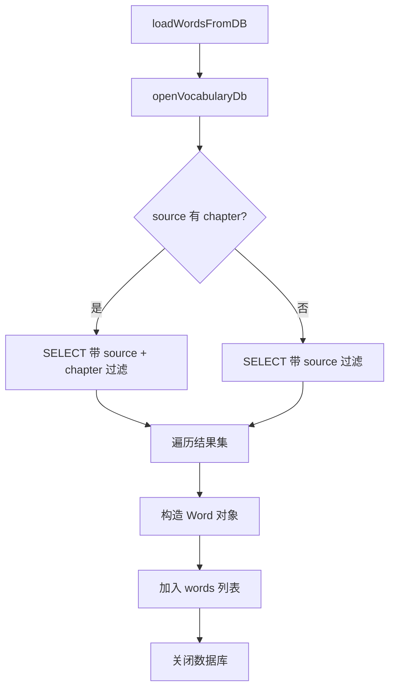
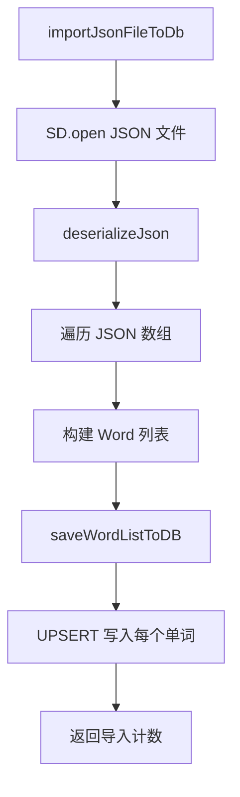

# UtilsDb.ino

> 最后更新日期: 2026/07/11

## 作用

`UtilsDb.ino` 是项目的 **SQLite 数据库访问层**。负责词库数据的 CRUD 操作、数据库初始化、词库浏览和导入导出。它将原先分散在 `UtilsData.ino` 中的 JSON 文件操作统一替换为 SQLite 查询，解决了大词库加载慢、内存占用高的问题。

## 数据库结构

### 日语（`jp_words.db`）

```sql
CREATE TABLE IF NOT EXISTS jp_words (
    id INTEGER PRIMARY KEY AUTOINCREMENT,
    jp TEXT NOT NULL,
    zh TEXT NOT NULL,
    kanji TEXT DEFAULT '',
    romaji TEXT DEFAULT '',
    tone INTEGER DEFAULT 0,
    score INTEGER DEFAULT 3
);

CREATE TABLE IF NOT EXISTS jp_source (
    id INTEGER PRIMARY KEY AUTOINCREMENT,
    word_id INTEGER NOT NULL,
    source TEXT NOT NULL,
    chapter TEXT DEFAULT '',
    FOREIGN KEY (word_id) REFERENCES jp_words(id)
);

CREATE TABLE IF NOT EXISTS jp_dictation_errors (
    id INTEGER PRIMARY KEY AUTOINCREMENT,
    word_id INTEGER NOT NULL,
    wrong TEXT NOT NULL,
    created_at TEXT NOT NULL,
    FOREIGN KEY (word_id) REFERENCES jp_words(id)
);
```

### 英语（`en_words.db`）

```sql
CREATE TABLE IF NOT EXISTS en_words (
    id INTEGER PRIMARY KEY AUTOINCREMENT,
    en TEXT NOT NULL,
    zh TEXT NOT NULL,
    pos TEXT DEFAULT '',
    phonetic TEXT DEFAULT '',
    score INTEGER DEFAULT 3
);

CREATE TABLE IF NOT EXISTS en_source (
    id INTEGER PRIMARY KEY AUTOINCREMENT,
    word_id INTEGER NOT NULL,
    source TEXT NOT NULL,
    chapter TEXT DEFAULT '',
    FOREIGN KEY (word_id) REFERENCES en_words(id)
);

CREATE TABLE IF NOT EXISTS en_dictation_errors (
    id INTEGER PRIMARY KEY AUTOINCREMENT,
    word_id INTEGER NOT NULL,
    wrong TEXT NOT NULL,
    created_at TEXT NOT NULL,
    FOREIGN KEY (word_id) REFERENCES en_words(id)
);
```

**数据库文件位置：**

| 语言 | 数据库文件 |
|------|-----------|
| 日语 | `/words_study/jp/jp_words.db` |
| 英语 | `/words_study/en/en_words.db` |

## 核心函数

### 表名映射

| 函数 | 返回值 |
|------|--------|
| `currentWordTable()` | `"jp_words"` 或 `"en_words"` |
| `currentSourceTable()` | `"jp_source"` 或 `"en_source"` |
| `currentDictationErrorTable()` | `"jp_dictation_errors"` 或 `"en_dictation_errors"` |

### 数据库操作

| 函数 | 作用 |
|------|------|
| `openVocabularyDb(&db)` | 打开当前语言的 SQLite 数据库 |
| `prepareStatement(db, sql, &stmt)` | 准备 SQL 语句，失败时打印错误日志 |
| `sqliteColumnText(stmt, col)` | 安全获取列的文本值 |
| `ensureDictationErrorTable(db)` | 确保当前语言的听写错误表存在 |

### 词库读写

| 函数 | 作用 |
|------|------|
| `loadWordsFromDB(source, chapter)` | 按 source/chapter 筛选加载词库到 `words` |
| `saveCurrentWordsToDB()` | 将当前 `words` 的 score 批量回写到数据库 |
| `saveWordListToDB(source, chapter, list)` | 将词库列表导入数据库（upsert） |
| `importJsonFileToDb(jsonPath, source, chapter, &count, &error)` | 从 JSON 文件导入到数据库 |

### 词库浏览

| 函数 | 作用 |
|------|------|
| `loadSourceList(items)` | 列出当前语言下的所有 source |
| `loadChapterList(source, items)` | 列出指定 source 下的所有 chapter |
| `sourceHasChapters(source)` | 判断 source 是否包含 chapter 子划分 |

### 路径解析

| 函数 | 作用 |
|------|------|
| `parseVocabPath(path, &isRoot, &source, &chapter)` | 将虚拟路径解析为 source/chapter |
| `isValidVocabPath(path)` | 校验虚拟路径是否合法 |
| `deriveUploadTarget(path, filename, &source, &chapter)` | 从上传请求推导 source 和 chapter |

### 错题管理

| 函数 | 作用 |
|------|------|
| `saveDictationErrorsToDB(errors)` | 将听写错误批量写入数据库 |
| `loadDictationReviewEntriesFromDB(items)` | 从数据库加载历史错题回顾列表 |

### 辅助

| 函数 | 作用 |
|------|------|
| `normalizeScoreValue(score)` | 将 score 钳位到 1~5 范围 |

## 关键流程

### 词库加载流程



### JSON 导入流程



### 自动保存流程


## 重要细节

### Word ID 与 dbId

每个 `Word` 结构体包含 `dbId` 字段，记录该单词在数据库中的主键。`loadWordsFromDB()` 会填充此字段，`saveCurrentWordsToDB()` 通过 `dbId` 进行 UPDATE 操作。

### UPSERT 策略

`saveWordListToDB()` 使用两步操作实现导入：
1. 先查询是否已存在相同 `(jp/en, source, chapter)` 的单词
2. 若存在则更新，不存在则插入
3. 同时维护 `*_source` 关联表

### score 规范化

- `normalizeScoreValue()`：score < 1 → 1，score > 5 → 5。
- 加载时自动应用，写回时也会校验。

## 使用示例

### 加载词库

```cpp
std::vector<Word> words;
loadWordsFromDB("Demo_Basics", "");        // 加载整个 source
loadWordsFromDB("Lesson", "Unit_1");       // 加载 source 的特定 chapter
```

### 导入 JSON

```cpp
int count = 0;
String error;
if (importJsonFileToDb("/words_study/jp/word/N5/vocab.json", "N5", "", count, error)) {
    Serial.printf("导入了 %d 个单词\n", count);
} else {
    Serial.printf("导入失败: %s\n", error.c_str());
}
```

### 浏览词库

```cpp
std::vector<String> sources;
loadSourceList(sources);  // 获取所有 source 名称
for (auto &s : sources) {
    if (sourceHasChapters(s)) {
        std::vector<String> chapters;
        loadChapterList(s, chapters);
    }
}
```

## 注意事项

- 数据库文件通过 SQLite 的 WAL 模式访问，支持并发读写。
- `saveWordListToDB()` 在导入时使用事务，确保数据一致性。
- `openVocabularyDb()` 失败时会打印 Serial 错误日志并返回 `false`。
- 虚拟路径格式为 `/words_study/<lang>/word`，内部通过 `parseVocabPath()` 解析为 source/chapter。
