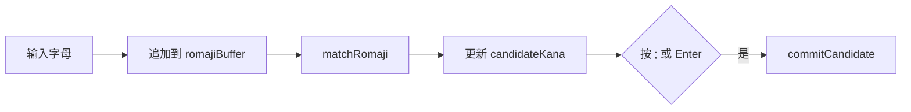
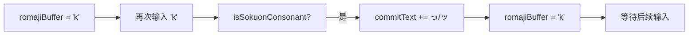

# UtilsIme.ino

> 最后更新日期: 2026/06/22

## 作用

`UtilsIme.ino` 实现 **日语罗马音→假名输入法（IME）**。在日语听写模式下，将用户输入的罗马音序列实时转换为平假名或片假名，支持促音检测、候选提交和 UTF-8 字符删除。

## 核心对象

| 对象 | 类型 | 说明 |
|------|------|------|
| `commitText` | `String` | 已确认提交的假名字符串（全局，定义在 ModeDictation.ino） |
| `romajiBuffer` | `String` | 当前未提交的罗马音缓冲 |
| `candidateKana` | `String` | 当前缓冲匹配到的候选假名 |
| `useKatakana` | `bool` | 当前输入模式：false=平假名，true=片假名 |
| `RomajiMap` | `struct` | `{romaji, hira, kata}` 映射条目 |
| `ROMAJI_TABLE[]` | `RomajiMap[]` | 完整映射表 |
| `ROMAJI_TABLE_SIZE` | `int` | 映射表条目数 |

## 关键函数

| 函数 | 作用 |
|------|------|
| `commitCandidate()` | 将 `candidateKana` 追加到 `commitText`，清空缓冲与候选 |
| `isSokuonConsonant(c)` | 判断字符是否为可促音辅音 `k/s/t/p` |
| `matchRomaji(buffer, useKatakana)` | 在映射表中查找罗马音，返回对应假名 |
| `removeLastUTF8Char(s)` | 删除 UTF-8 字符串末尾一个完整字符 |

## 罗马音映射表

映射表覆盖：

- **清音**：あ行 ~ わ行
- **浊音**：が・ざ・だ・ば 行
- **半浊音**：ぱ 行
- **拗音**：きゃ/しゃ/ちゃ/にゃ 等
- **长音**：`-` → `ー`（仅片假名有效）

示例条目：

| 罗马音 | 平假名 | 片假名 |
|--------|--------|--------|
| `ka` | か | カ |
| `shi` | し | シ |
| `tsu` | つ | ツ |
| `kya` | きゃ | キャ |
| `-` | （空） | ー |

## 关键流程

### 普通输入

### 促音输入

## 重要细节

- **候选显示**：`candidateKana` 仅在匹配成功时显示在屏幕中央下方，提示用户当前缓冲可转换为什么假名。
- **提交触发**：按 `;` 或 Enter 时都会调用 `commitCandidate()`；Enter 还会进行答案判定。
- **模式切换**：按 Shift 切换 `useKatakana` 后，会重新计算当前候选假名。
- **删除逻辑**：
  - 若 `romajiBuffer` 非空，删除其末尾一个 ASCII 字符。
  - 否则调用 `removeLastUTF8Char(commitText)` 删除最后一个假名/汉字。

## 使用示例

### 输入「学校」（がっこう）

| 按键 | romajiBuffer | candidateKana | commitText |
|------|--------------|---------------|------------|
| `g` | `g` | （空） | （空） |
| `a` | `ga` | `が` | （空） |
| `;` | （空） | （空） | `が` |
| `k` | `k` | （空） | `が` |
| `k` | `k` | （空） | `がっ` |
| `o` | `ko` | `こ` | `がっ` |
| `u` | `kou` | （空） | `がっ` |
| `;` | （空） | （空） | `がっこう` |

## 注意事项

- 映射表未包含所有罗马音变体（如 `si` 对应 `し` 不在表中，实际只有 `shi`）。用户需按表中拼写输入。
- 长音符号 `-` 的平假名为空字符串，因此输入 `-` 时平假名模式下无可见输出，切换到片假名模式才显示 `ー`。
- `removeLastUTF8Char()` 通过识别 `10xxxxxx` 后续字节定位字符起始位置，可正确处理中文、日文等多字节字符。
