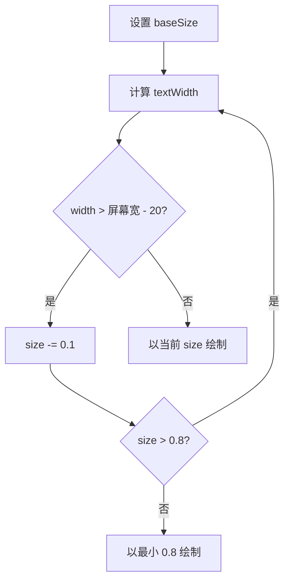

# UtilsString.ino

> 最后更新日期: 2026/06/22

## 作用

`UtilsString.ino` 是项目的 **字符串处理与高级文本绘制工具库**。提供自适应字号绘制、屏幕四角文本绘制、IPA 音标到 ASCII 的转换，以及英语听写答案规范化。

## 核心函数

| 函数 | 作用 |
|------|------|
| `drawAutoFitString(cv, text, x, y, baseSize)` | 自适应字号居中绘制文本 |
| `drawTopLeftString(cv, text, color, size)` | 左上角绘制 |
| `drawTopRightString(cv, text, color, size)` | 右上角绘制 |
| `drawCenterString(cv, message, color, size)` | 屏幕中央提示 |
| `asciiPhonetic(s)` | 将 IPA 音标 Unicode 字符转为 ASCII 近似 |
| `isEnglishInputChar(c)` | 判断字符是否可输入英语答案 |
| `normalizeEnglishAnswer(s)` | 规范化英语答案用于比对 |

## 关键流程

### 自适应字号



### IPA 转 ASCII

| IPA Unicode | ASCII |
|-------------|-------|
| `æ` (U+00E6) | `ae` |
| `ð` / `θ` | `th` |
| `ŋ` | `ng` |
| `ʃ` | `sh` |
| `ʒ` | `zh` |
| `ə` | `e` |
| `ɜː` / `ɝ` / `ɚ` | `er` |
| `ː` | `:` |
| `ˈ` | `'` |
| `ˌ` | `,` |

## 重要细节

- **自适应字号**：以 `baseSize` 开始，每次减 0.1，最小到 0.8。文本以 `middle_center` 对齐方式绘制。
- **角标坐标**：左上角 `(8, 8)`，右上角 `(width-8, 8)`，使用对应 `TextDatum`。
- **英语答案规范化**：
  - `trim()` 去首尾空
  - `toLowerCase()` 转小写
  - `_` 替换为空格
  - 合并连续空格为单个空格
- **IPA 处理**：按 UTF-8 双字节模式匹配；无法识别的多字节字符会被跳过。

## 使用示例

### 绘制自适应单词

```cpp
drawAutoFitString(canvas, w.en, canvas.width()/2, canvas.height()/2 - 25, 2.2);
```

### 显示页面标题

```cpp
drawTopLeftString(canvas, "学习统计", GREEN, 1.2);
drawTopRightString(canvas, "1/3", TFT_DARKGREY, 1.0);
```

### 英语答案比对

```cpp
String userAnswer = normalizeEnglishAnswer(dictEnInput);
String correct    = normalizeEnglishAnswer(words[idx].en);
bool isCorrect = (userAnswer == correct);
```

## 注意事项

- `drawAutoFitString()` 在文本为空时直接返回，不会清空或影响画布其他内容。
- IPA 转换是近似处理，会丢失部分发音细节，但足以在屏幕上显示可读的发音提示。
- `normalizeEnglishAnswer()` 不处理标点符号，因此英语词库中若包含逗号、句点等符号，需保证标准答案与用户输入都经过相同处理。
