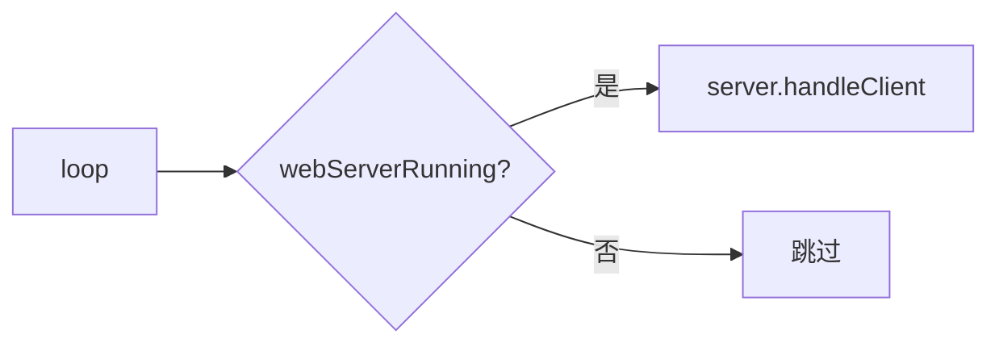
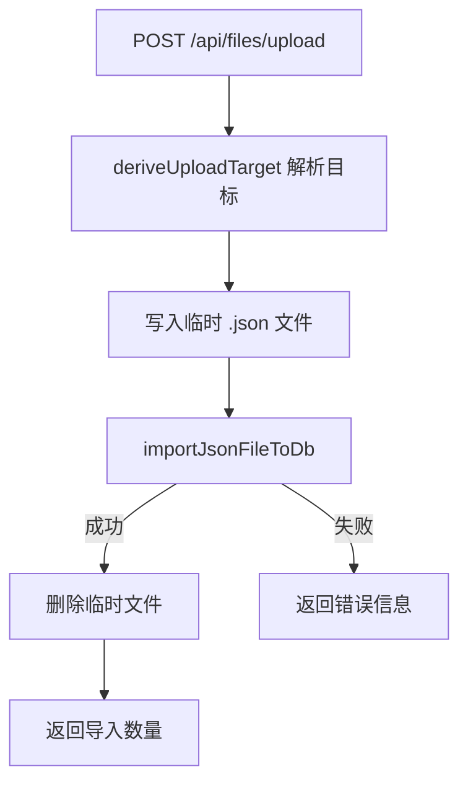

# UtilsWebServer.ino

> 最后更新日期: 2026/07/11

## 作用

`UtilsWebServer.ino` 在 ESP32 上运行 **轻量级 HTTP Web 控制面板服务器**。设备成功连接 WiFi 后启动，提供浏览器端词库管理（SQLite 数据库浏览、JSON 导入导出、词库删除）、学习统计查看、设备设置调节和运行状态查询。

## 核心对象

| 对象 | 类型 | 说明 |
|------|------|------|
| `server` | `WebServer` | 监听 80 端口的 HTTP 服务器 |
| `webServerRunning` | `bool` | 服务器是否已启动 |
| `uploadFile` | `File` | 文件上传时使用的临时文件句柄 |
| `uploadTargetSource` / `uploadTargetChapter` | `String` | 上传导入的目标 source/chapter |
| `uploadImportedCount` | `int` | 导入成功数量 |
| `uploadError` | `String` | 上传错误信息 |

## API 路由

| 路由 | 方法 | 说明 |
|------|------|------|
| `/` | GET | 返回 `words_study/www/index.html` |
| `/api/files` | GET | 浏览词库数据库的 source / chapter 结构 |
| `/api/files/upload` | POST | 上传 JSON 文件并导入到数据库 |
| `/api/files` | DELETE | 删除 source 或 chapter（数据库操作） |
| `/api/files/download` | GET | 将 source / chapter 导出为 JSON 下载 |
| `/api/stats` | GET | 当前词库统计 |
| `/api/settings` | GET | 获取音量/亮度/阈值/语言/WiFi 状态 |
| `/api/settings` | POST | 修改音量/亮度/自动保存阈值 |
| `/api/device` | GET | 获取 IP/可用堆/运行时间 |

## 关键流程

### 服务器初始化

### 主循环处理

## 重要细节

### 词库浏览（数据库驱动）

`GET /api/files` 不再列出 SD 卡文件系统中的 JSON 文件，而是查询 SQLite 数据库：

- **根层**（`isRoot=true`）：列出 `*_source` 表中所有 source 及其词条数和章节数。
- **source 层**（`chapter` 为空）：列出该 source 下的所有 chapter + "全部" 虚拟条目。

### 文件上传与 JSON 导入

上传流程已改为自动导入数据库：

- 上传到根层：文件名 stem 作为 source
- 上传到 source 层：文件名 stem 作为 chapter

### 词库删除

`DELETE /api/files` 执行数据库级删除：
1. 从 `*_source` 表删除映射记录
2. 调用 `deleteOrphanWords()` 清理无映射的孤儿词条
3. 外键级联删除关联的错题记录
4. 使用事务保证原子性

### 词库导出

`GET /api/files/download` 从数据库查询词条并流式输出为 JSON 数组，响应头带 `Content-Disposition: attachment`。

### 设置 API 变更

`POST /api/settings` 新增支持 `autoSaveThreshold` 字段，修改后立即调用 `saveAppConfig()` 持久化。

### 路径安全

- `isValidVocabPath(path)` 通过 `parseVocabPath()` 校验虚拟路径合法性。
- 所有操作前会先打开数据库并验证连接。

### CORS 支持

- 所有 API 路由都通过 `sendCorsHeaders()` 添加跨域头。
- 每个路由注册了 `OPTIONS` 预检处理函数 `handleOptions()`。

## 使用示例

### 浏览器访问

1. 设备连接 WiFi 后，在状态页查看 IP，如 `192.168.1.105`。
2. 在同一局域网浏览器打开 `http://192.168.1.105`。
3. 使用"文件管理"浏览词库、上传 JSON 导入、导出备份，使用"学习统计"查看进度，使用"设备设置"调节音量亮度。

## 注意事项

- 前端页面 `index.html` 必须放在 SD 卡 `/words_study/www/index.html`，否则根路径会返回提示页面。
- Web 服务器在 `loop()` 末尾以非阻塞方式处理请求，不会影响学习模式的键盘响应。
- 上传的 JSON 文件通过临时文件方式写入 SD 卡后导入数据库，导入成功后自动清理临时文件。
- 删除操作使用 SQLite 事务，若任一步骤失败则 ROLLBACK。
