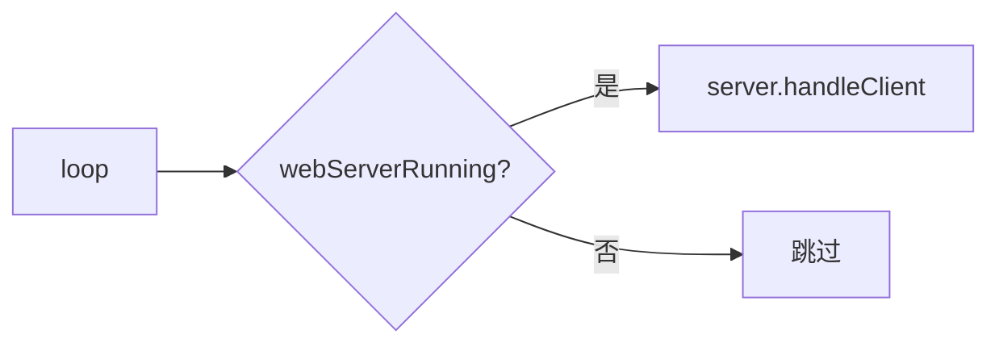

# UtilsWebServer.ino

> 最后更新日期: 2026/06/22

## 作用

`UtilsWebServer.ino` 在 ESP32 上运行 **轻量级 HTTP Web 控制面板服务器**。设备成功连接 WiFi 后启动，提供浏览器端文件管理、学习统计查看、音量亮度调节和设备状态查询。

## 核心对象

| 对象 | 类型 | 说明 |
|------|------|------|
| `server` | `WebServer` | 监听 80 端口的 HTTP 服务器 |
| `webServerRunning` | `bool` | 服务器是否已启动 |
| `uploadFile` | `File` | 文件上传时使用的临时文件句柄 |

## API 路由

| 路由 | 方法 | 说明 |
|------|------|------|
| `/` | GET | 返回 `words_study/www/index.html` |
| `/api/files` | GET | 列出目录内容 |
| `/api/files/upload` | POST | 上传文件（multipart） |
| `/api/files` | DELETE | 删除文件 |
| `/api/files/download` | GET | 下载文件 |
| `/api/stats` | GET | 当前词库统计 |
| `/api/settings` | GET | 获取音量/亮度/语言/WiFi 状态 |
| `/api/settings` | POST | 修改音量/亮度 |
| `/api/device` | GET | 获取 IP/可用堆/运行时间 |

## 关键流程

### 服务器初始化


### 主循环处理



## 重要细节

### 路径安全

- `isValidSDPath(path)` 要求路径必须以 `/words_study/` 开头且不包含 `..`。
- 所有文件管理 API 都经过该校验，防止目录穿越。

### CORS 支持

- 所有 API 路由都通过 `sendCorsHeaders()` 添加跨域头：
  - `Access-Control-Allow-Origin: *`
  - `Access-Control-Allow-Methods: GET,POST,DELETE,OPTIONS`
  - `Access-Control-Allow-Headers: Content-Type`
- 每个路由都注册了 `OPTIONS` 预检处理函数 `handleOptions()`。

### 文件上传

- 使用 `HTTPUpload` 分块处理：
  - `UPLOAD_FILE_START`：创建目标文件
  - `UPLOAD_FILE_WRITE`：写入数据块
  - `UPLOAD_FILE_END`：关闭文件
  - `UPLOAD_FILE_ABORTED`：关闭并丢弃

### 请求/响应示例

#### 获取文件列表

```bash
GET /api/files?path=/words_study/en/word
```

```json
{
  "path": "/words_study/en/word",
  "items": [
    { "name": "Demo_Basics.json", "isDir": false, "size": 1234 },
    { "name": "travel", "isDir": true }
  ]
}
```

#### 修改音量

```bash
POST /api/settings
Content-Type: application/json

{ "volume": 200 }
```

```json
{ "ok": true, "volume": 200, "brightness": 200 }
```

#### 获取统计

```bash
GET /api/stats
```

```json
{
  "file": "Demo_Basics.json",
  "total": 4,
  "avg": 3.25,
  "median": 3,
  "level": "掌握中",
  "counts": { "1": 0, "2": 1, "3": 2, "4": 1, "5": 0 }
}
```

## 使用示例

### 浏览器访问

1. 设备连接 WiFi 后，在状态页查看 IP，如 `192.168.1.105`。
2. 在同一局域网浏览器打开 `http://192.168.1.105`。
3. 使用“文件管理”上传/下载/删除词库，使用“学习统计”查看进度，使用“设备设置”调节音量亮度。

## 注意事项

- 前端页面 `index.html` 必须放在 SD 卡 `/words_study/www/index.html`，否则根路径会返回提示页面。
- Web 服务器在 `loop()` 末尾以非阻塞方式处理请求，不会影响学习模式的键盘响应。
- `handleApiFileUpload()` 仅返回 `{"ok":true}`，实际文件写入在 `handleApiFileUploadData()` 中完成。
