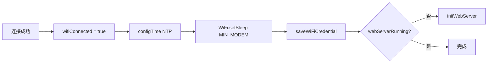
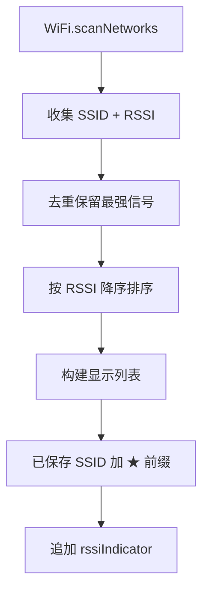

# UtilsWiFi.ino

> 最后更新日期: 2026/06/22

## 作用

`UtilsWiFi.ino` 负责设备的 **WiFi 连接、凭据持久化、扫描结果处理、NTP 时间同步和省电管理**。是 Web 控制台和错题本时间戳功能的基础。

## 核心对象

| 对象 | 类型 | 说明 |
|------|------|------|
| `WiFiCredential` | `struct` | `{ssid, pass}` |
| `savedWiFiList` | `vector<WiFiCredential>` | 已保存的 WiFi 凭据 |

## 核心函数

| 函数 | 作用 |
|------|------|
| `loadSavedWiFiCredentials()` | 从 `/words_study/wifi.json` 加载凭据 |
| `saveWiFiCredential(ssid, pass)` | 保存或更新一组凭据 |
| `findSavedPassword(ssid)` | 查找已保存密码 |
| `processWiFiScanResults(count)` | 处理扫描结果：去重、排序、标记已保存 |
| `attemptWiFiConnect()` | 尝试连接 WiFi，成功后启动 Web 服务器 |
| `getNtpTimeString()` | 返回 `YY-MM-DD_HH-MM` 格式时间 |
| `rssiIndicator(rssi)` | RSSI 转可视化信号强度 |

## 关键流程

### WiFi 连接成功后的处理



### 扫描结果处理



## 重要细节

### 凭据存储格式

`/words_study/wifi.json`：

```json
[
  { "ssid": "MyHome", "pass": "password123" },
  { "ssid": "Office", "pass": "office_wifi" }
]
```

- 同名 SSID 更新密码，新 SSID 追加。
- 保存前先 `SD.remove()` 旧文件，再写入新内容。

### 时间同步

- NTP 服务器：`pool.ntp.org`、`time.nist.gov`
- 时区：UTC+8（`8 * 3600` 秒）
- 未连接 WiFi 或 NTP 同步失败时，`getNtpTimeString()` 返回 `String(millis())`。

### 信号指示

| RSSI | 指示 |
|------|------|
| > -50 dBm | `[###]` |
| > -70 dBm | `[## ]` |
| ≤ -70 dBm | `[#  ]` |

### 省电

- 连接成功后启用 `WIFI_PS_MIN_MODEM`，在无数据传输时自动关闭射频以降低功耗。

## 使用示例

### 连接并保存凭据

```cpp
wifiSelectedSSID = "MyHome";
wifiPasswordInput = "password123";
attemptWiFiConnect();
```

### 查找已保存密码

```cpp
String pass = findSavedPassword("MyHome");
if (pass.length() > 0) {
    wifiPasswordInput = pass;
    attemptWiFiConnect();
}
```

## 注意事项

- `loadSavedWiFiCredentials()` 在文件不存在或解析失败时静默忽略，不会报错。
- `attemptWiFiConnect()` 在失败时会阻塞约 10 秒等待连接，期间 UI 显示“连接中...”。
- Web 服务器仅在首次连接成功后启动一次；后续断开并重新连接时不会重复启动（通过 `webServerRunning` 判断）。
