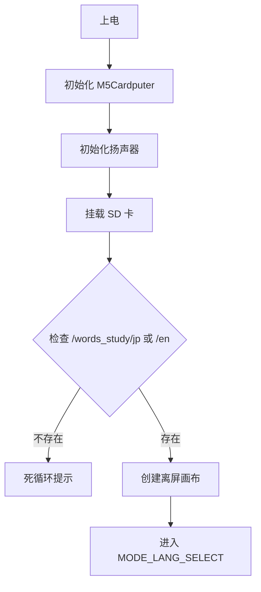
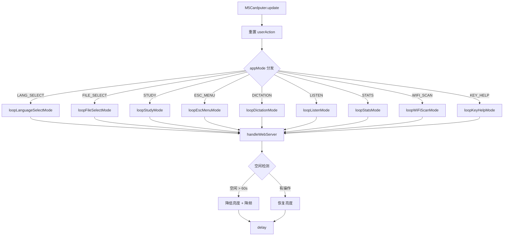

# WordCardputer.ino

> 最后更新日期: 2026/06/22

## 作用

`WordCardputer.ino` 是整个单词学习机的**主程序入口**。它定义全局状态、数据结构、硬件配置，并实现 Arduino 标准的 `setup()` 与 `loop()` 生命周期。所有模式（Mode）与工具（Utils）模块通过函数声明在此汇总，由 `loop()` 根据当前 `appMode` 统一分发。

## 核心对象

| 对象/变量 | 类型 | 说明 |
|----------|------|------|
| `AppMode` | `enum` | 应用运行模式：`MODE_LANG_SELECT`、`MODE_FILE_SELECT`、`MODE_STUDY`、`MODE_ESC_MENU`、`MODE_DICTATION`、`MODE_LISTEN`、`MODE_STATS`、`MODE_WIFI_SCAN`、`MODE_KEY_HELP` |
| `StudyLanguage` | `enum` | 学习语言：`LANG_JP`（日语）、`LANG_EN`（英语） |
| `appMode` | `AppMode` | 当前运行模式 |
| `previousMode` | `AppMode` | 进入 ESC 菜单前的模式，用于退出时恢复 |
| `canvas` | `M5Canvas` | 全局离屏画布，所有 UI 统一在此绘制后再 `pushSprite` 到屏幕 |
| `words` | `std::vector<Word>` | 当前加载的词库 |
| `Word` | `struct` | 兼容日/英的单词数据结构，字段见 [DataFormat.md](DataFormat.md) |
| `DictError` | `struct` | 听写错误记录：`wordIndex` + `wrong` |
| `scoresDirty` / `dirtyCount` | `bool` / `int` | 评分变更标记与计数，触发自动保存 |
| `soundVolume` | `int` | 扬声器音量，范围 0~255 |
| `wifiConnected` | `bool` | WiFi 连接状态 |

## 关键流程

### 启动流程



### 主循环流程



## 重要细节

- **SD 卡 SPI 引脚**：SCK=40、MISO=39、MOSI=14、CS=12，SPI 频率 25 MHz。
- **自动节能**：`idleTimeout = 60000` ms；无操作时亮度降至 40，loop 延迟从 30 ms 提升到 200 ms。
- **自动保存阈值**：`autoSaveThreshold = 5`，每累计 5 次 score 变更触发一次回写。
- **双缓冲绘制**：所有模式共享同一个 `M5Canvas` 离屏画布，避免闪烁。

## 使用示例

### 添加新模式

若新增 `MODE_XXX`，需完成以下三步：

```cpp
// 1. 在 enum AppMode 中追加
enum AppMode {
    // ...
    MODE_XXX,
};

// 2. 在 loop() 中添加分发
else if (appMode == MODE_XXX) {
    loopXxxMode();
}

// 3. 在文件顶部声明函数
void loopXxxMode();
```

## 注意事项

- `setup()` 中若 SD 卡初始化失败或词库目录不存在，会进入死循环并在屏幕上打印错误，必须重启或修复 SD 卡。
- `loopDelay` 在省电模式下变长，因此学习/听写等依赖键盘响应的模式应通过 `M5Cardputer.update()` 和 `Keyboard.isChange()` 自行保证实时性，不依赖固定 loop 周期。
- Web 服务器 `handleWebServer()` 在主循环末尾调用，即使未连接 WiFi 也会检查一次 `webServerRunning` 标志，开销极小。
