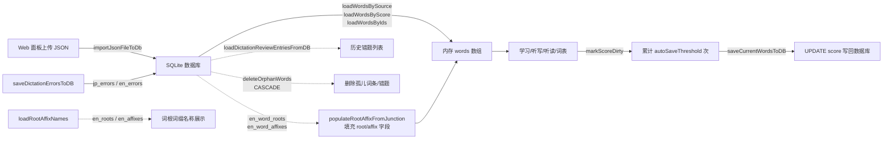

# 数据格式规范

> 最后更新日期: 2026/09/01

## 作用

本文档定义 WordCardputer 项目使用的 **SD 卡数据存储结构与数据格式规范**。项目已从 JSON 文件存储迁移至 SQLite 数据库，词库数据不再以独立 JSON 文件形式存在于 SD 卡上。

> ⚠️ **关于表结构**：C++ 源码中**不包含** `CREATE TABLE` 语句，数据库文件须由外部脚本预创建。下文 DDL 来自 SQL 查询中出现的列名反推，无法 100% 还原约束（`NOT NULL` / `DEFAULT` / 外键级联选项等），不确定处会以 `⚠️ 待确认` 标注。运行时唯一会执行的 DDL 是 `ensureDictationErrorTable()`，它会按以下结构创建听写错误表（见下文 `jp_errors` / `en_errors`）。

## 目录结构

SD 卡根目录必须包含 `words_study` 文件夹：

```
SD 卡根目录/
└── words_study/
    ├── config.json             # 设备配置文件（替代旧版 wifi.json）
    ├── .env                    # API Key 等敏感配置（PC 端工具使用）
    ├── jp/
    │   ├── jp_words.db         # 日语词库 SQLite 数据库
    │   └── audio/              # 日语发音 WAV
    │       ├── あめ.wav
    │       └── いぬ.wav
    ├── en/
    │   ├── en_words.db         # 英语词库 SQLite 数据库
    │   └── audio/              # 英语发音 WAV
    │       ├── apple.wav
    │       └── run.wav
    └── www/
        └── index.html          # Web 控制面板前端
```

> ⚠️ **已变更**：词库数据不再使用 `words_study/<lang>/word/` 目录下的独立 JSON 文件。旧版 JSON 文件可通过 Web 面板的导入功能迁移到数据库。

## 数据库结构

### 日语（`jp_words.db`）

#### jp_words 表

```sql
CREATE TABLE IF NOT EXISTS jp_words (
    id INTEGER PRIMARY KEY AUTOINCREMENT,
    jp TEXT NOT NULL,             -- 日语假名
    zh TEXT NOT NULL,             -- 中文释义
    kanji TEXT DEFAULT '',        -- 日语汉字写法
    romaji TEXT DEFAULT '',       -- 罗马音标注
    tone INTEGER DEFAULT 0,       -- 声调编号，-1 表示无/未知
    score INTEGER DEFAULT 3,      -- 熟练度 1~5
    sentence TEXT DEFAULT '',     -- 例句原文
    sentence_zh TEXT DEFAULT ''   -- 例句中文释义
);
```

#### jp_source 表

> ⚠️ 待确认 — 以下 DDL 由 SQL 查询（`INNER JOIN jp_source ON s.word_id = w.id`，列 `word_id` / `source` / `chapter`）反推，约束来自推断。

```sql
CREATE TABLE IF NOT EXISTS jp_source (
    id INTEGER PRIMARY KEY AUTOINCREMENT,
    word_id INTEGER NOT NULL,
    source TEXT NOT NULL,          -- 词库来源（如 "Demo_Basics"、"N5"）
    chapter TEXT DEFAULT '',       -- 章节（如 "Unit_1"），空表示无章节
    FOREIGN KEY (word_id) REFERENCES jp_words(id)
);
```

#### jp_errors 表（听写错误事件表）

> ✅ **运行时实际创建** — 由 `UtilsDb.cpp` 中的 `ensureDictationErrorTable()` 在首次访问时通过 `CREATE TABLE IF NOT EXISTS` 创建。表名短名为 `jp_errors`（**非** `jp_dictation_errors`，旧文档已过时）。

```sql
CREATE TABLE IF NOT EXISTS jp_errors (
    id INTEGER PRIMARY KEY AUTOINCREMENT,
    word_id INTEGER NOT NULL,
    wrong_text TEXT NOT NULL,      -- 用户错误输入
    created_at TEXT NOT NULL,      -- 错误发生时间（ISO 字符串）
    FOREIGN KEY (word_id) REFERENCES jp_words(id) ON DELETE CASCADE
);
```

### 英语（`en_words.db`）

#### en_words 表

```sql
CREATE TABLE IF NOT EXISTS en_words (
    id INTEGER PRIMARY KEY AUTOINCREMENT,
    en TEXT NOT NULL,              -- 英语单词或短语
    zh TEXT NOT NULL,              -- 中文释义
    pos TEXT DEFAULT '',           -- 词性（noun/verb/adj 等）
    phonetic TEXT DEFAULT '',      -- IPA 音标
    score INTEGER DEFAULT 3,       -- 熟练度 1~5
    sentence TEXT DEFAULT '',     -- 例句原文
    sentence_zh TEXT DEFAULT ''   -- 例句中文释义
);
```

#### en_source 表

> ⚠️ 待确认 — 与 `jp_source` 结构相同，由 SQL 查询反推。

```sql
CREATE TABLE IF NOT EXISTS en_source (
    id INTEGER PRIMARY KEY AUTOINCREMENT,
    word_id INTEGER NOT NULL,
    source TEXT NOT NULL,
    chapter TEXT DEFAULT '',
    FOREIGN KEY (word_id) REFERENCES en_words(id)
);
```

#### en_errors 表（听写错误事件表）

> ✅ **运行时实际创建** — 由 `UtilsDb.cpp` 中的 `ensureDictationErrorTable()` 在首次访问时通过 `CREATE TABLE IF NOT EXISTS` 创建。表名短名为 `en_errors`（**非** `en_dictation_errors`）。

```sql
CREATE TABLE IF NOT EXISTS en_errors (
    id INTEGER PRIMARY KEY AUTOINCREMENT,
    word_id INTEGER NOT NULL,
    wrong_text TEXT NOT NULL,
    created_at TEXT NOT NULL,
    FOREIGN KEY (word_id) REFERENCES en_words(id) ON DELETE CASCADE
);
```

#### en_roots 表 — 词根词典

> ⚠️ 待确认 — 表结构由 `loadRootAffixNames()` 中 `SELECT root, meaning FROM en_roots WHERE id IN (...)` 反推。

```sql
CREATE TABLE IF NOT EXISTS en_roots (
    id INTEGER PRIMARY KEY AUTOINCREMENT,
    root TEXT NOT NULL,            -- 词根名称（如 "struct"）
    meaning TEXT DEFAULT ''        -- 词根释义（如 "建造"）
);
```

#### en_affixes 表 — 词缀词典

> ⚠️ 待确认 — 表结构由 `loadRootAffixNames()` 中 `SELECT affix, meaning FROM en_affixes WHERE id IN (...)` 反推。

```sql
CREATE TABLE IF NOT EXISTS en_affixes (
    id INTEGER PRIMARY KEY AUTOINCREMENT,
    affix TEXT NOT NULL,           -- 词缀名称（如 "un-"、"-tion"）
    meaning TEXT DEFAULT ''        -- 词缀释义（如 "否定"、"动作/状态"）
);
```

#### en_word_roots 表 — 词根关联

> ⚠️ 待确认 — 列由 `SELECT word_id, root_id FROM en_word_roots WHERE word_id IN (...)` 反推。

```sql
CREATE TABLE IF NOT EXISTS en_word_roots (
    id INTEGER PRIMARY KEY AUTOINCREMENT,
    word_id INTEGER NOT NULL,
    root_id INTEGER NOT NULL,
    FOREIGN KEY (word_id) REFERENCES en_words(id),
    FOREIGN KEY (root_id) REFERENCES en_roots(id)
);
```

#### en_word_affixes 表 — 词缀关联

> ⚠️ 待确认 — 列由 `SELECT word_id, affix_id FROM en_word_affixes WHERE word_id IN (...)` 反推。

```sql
CREATE TABLE IF NOT EXISTS en_word_affixes (
    id INTEGER PRIMARY KEY AUTOINCREMENT,
    word_id INTEGER NOT NULL,
    affix_id INTEGER NOT NULL,
    FOREIGN KEY (word_id) REFERENCES en_words(id),
    FOREIGN KEY (affix_id) REFERENCES en_affixes(id)
);
```

> 词根/词缀数据通过关联表批量查询，加载单词后由 `populateRootAffixFromJunction()` 将关联的 ID 列表拼接到 `Word.root` / `Word.affix` 字段中。

### 字段汇总

| 字段 | 类型 | 必填 | 说明 |
|------|------|:----:|------|
| `jp` / `en` | TEXT | 是 | 日语假名或英语单词 |
| `zh` | TEXT | 是 | 中文释义 |
| `kanji` | TEXT | 否 | 日语汉字写法 |
| `romaji` | TEXT | 否 | 罗马音标注 |
| `tone` | INTEGER | 否 | 声调编号。C++ 加载/导入默认 -1（无/未知），DDL `DEFAULT 0` ⚠️ 待确认 |
| `pos` | TEXT | 否 | 词性（仅英语） |
| `phonetic` | TEXT | 否 | IPA 音标（仅英语） |
| `sentence` | TEXT | 否 | 例句原文（DDL 中也写作 `sentence`，但 `_zh` 风格是 `sentence_zh`） |
| `sentence_zh` | TEXT | 否 | 例句中文释义 |
| `score` | INTEGER | 是 | 熟练度 1~5，默认 3（运行时统一经 `normalizeScoreValue()` 钳位） |
| `source` | TEXT | 是 | 词库来源标识（通过关联表） |
| `chapter` | TEXT | 否 | 章节标识（通过关联表） |
| `wrong_text` | TEXT | 是 | 听写错误用户输入（错误事件表 `jp_errors` / `en_errors` 的列） |
| `created_at` | TEXT | 是 | 错误发生时间（ISO 字符串，由 ModeDictation 在写入时生成） |
| `root` | TEXT | — | 词根 ID 列表（逗号分隔，运行时由 `populateRootAffixFromJunction()` 拼接，非数据库列） |
| `affix` | TEXT | — | 词缀 ID 列表（逗号分隔，运行时由 `populateRootAffixFromJunction()` 拼接，非数据库列） |

### 数据库表名汇总

| 用途 | 日语 | 英语 | 来源 |
|------|------|------|------|
| 词表 | `jp_words` | `en_words` | `currentWordTable()` |
| source 关联表 | `jp_source` | `en_source` | `currentSourceTable()` |
| 听写错误事件表 | `jp_errors` | `en_errors` | `currentDictationErrorTable()` |
| 词根词典 | — | `en_roots` | 直接表名（仅英语） |
| 词缀词典 | — | `en_affixes` | 直接表名（仅英语） |
| 词根关联 | — | `en_word_roots` | 直接表名（仅英语） |
| 词缀关联 | — | `en_word_affixes` | 直接表名（仅英语） |

## 配置文件（config.json）

统一配置文件替代了旧版 `wifi.json`，结构如下：

```json
{
  "version": 1,
  "settings": {
    "volume": 192,
    "language": "jp",
    "brightness": 200,
    "dim_brightness": 40,
    "idle_timeout_ms": 60000,
    "auto_save_threshold": 5
  },
  "wifi": [
    { "ssid": "MyHome", "pass": "password123" }
  ]
}
```

详见 [UtilsConfig.md](UtilsConfig.md)。

## 其他文件

### `.env`

PC 端 Python 工具使用，包含 API Key 等敏感信息。示例：

```bash
API_KEY=your_minimax_api_key_here
```

该文件不应提交到版本控制。

## 数据流



## JSON 兼容性

> ⚠️ **兼容说明**：旧版 JSON 词库格式仍受支持，可通过 Web 控制面板的导入功能转换为数据库格式。JSON 格式与旧版相同——顶层必须是数组，包含对象元素，字段与上述数据库字段一一对应。

### 日语 JSON 示例（导入用）

```json
[
  {
    "jp": "わたし",
    "zh": "我",
    "kanji": "私",
    "tone": 0,
    "score": 3,
    "romaji": "watashi"
  }
]
```

### 英语 JSON 示例（导入用）

```json
[
  {
    "en": "run",
    "zh": "跑；运行",
    "pos": "verb",
    "phonetic": "/rʌn/",
    "score": 3
  }
]
```

## 音频文件要求

| 参数 | 要求 |
|------|------|
| 格式 | WAV |
| 编码 | PCM（线性脉冲编码调制） |
| 位深 | 8-bit 或 16-bit |
| 声道 | 单声道或立体声 |
| 采样率 | ≤ 48 kHz，推荐 16 kHz |

### 文件命名

音频文件名必须与词库中的主键字段完全一致：

- 日语：`jp` 字段内容 + `.wav`
- 英语：`en` 字段内容 + `.wav`

示例：

| 词库字段 | 音频文件名 |
|----------|-----------|
| `"jp": "あめ"` | `あめ.wav` |
| `"en": "apple"` | `apple.wav` |

> 注意：文件名区分大小写，英语短语中的空格需与词库字段保持一致。

## 注意事项

- 数据库文件使用 **DELETE** journal 模式（不是 WAL！），单片机的 sqlite 库无法读取 WAL 模式的文件。`openVocabularyDb()` **不会** 主动设置 journal 模式，依赖数据库文件本身即为 DELETE 模式。
- `score` 字段在加载和保存时自动通过 `normalizeScoreValue()` 钳位到 1~5 范围。
- 音频文件缺失时，设备会播放 880Hz 提示音代替，不影响程序运行。
- 听写错题保存在数据库的 `jp_errors` / `en_errors` 表中（**短名**，旧文档曾使用 `*_dictation_errors`），列名为 `wrong_text`（注意不是 `wrong`）。该表由 `ensureDictationErrorTable()` 在首次访问时自动创建。
- `wrong_text` / `created_at` 是错误事件表的"事件"列，不存储完整词条；要查原词内容需 `LEFT JOIN jp_words` / `en_words`。
- 通过 Web 面板可随时将数据库中任意 source/chapter 导出为 JSON 文件备份。
- 词根词缀数据通过 `en_word_roots` / `en_word_affixes` 关联表管理，而非存为 `en_words` 的直接列。`populateRootAffixFromJunction()` 在每次加载词库后批量回填 `Word.root` / `Word.affix`。
- 删除 source / chapter 时通过 `BEGIN IMMEDIATE` 事务 + `deleteOrphanWords()` 一并清理不再属于任何来源的孤儿词条；词条被删时其错题记录会通过 `ON DELETE CASCADE` 自动清理。
