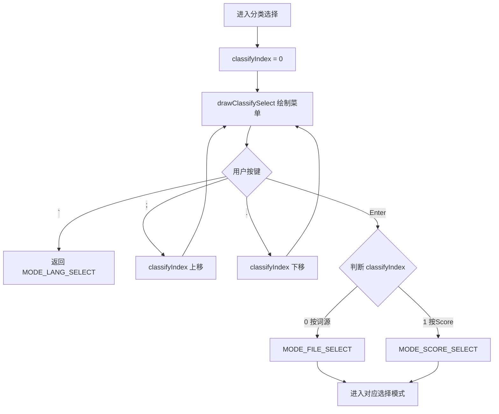

# ModeClassifySelect.ino

> 最后更新日期: 2026/07/29

## 作用

`ModeClassifySelect.ino` 实现**分类方式选择模式**，在语言选择和词源/章节选择之间提供一层"分类方式"选择中介。当前支持两种分类方式：**按词源分类**（按来源/章节）和 **按 Score 分类**（按学习分数），每种方式导向不同的后续选择模式。

此模式的设计目的是为未来扩展新的分类维度（如按难度、按词性等）提供统一入口。

## 核心对象

| 对象 | 类型 | 说明 |
|------|------|------|
| `classifyItems` | `std::vector<String>` | 分类方式列表：`{"按词源分类", "按Score分类"}` |
| `classifyIndex` | `int` | 当前高亮的分类方式索引 |

## 关键流程

## 重要细节

- **当前选项**：`classifyItems` 在 `globals.cpp` 中硬编码定义，包含"按词源分类"和"按Score分类"两项。
- **Enter 分发逻辑**：`classifyIndex == 0` 跳转 `MODE_FILE_SELECT`（词源选择），否则跳转 `MODE_SCORE_SELECT`（Score 选择）。
- **ESC 返回**：按 `` ` `` 键返回语言选择界面，不保存任何状态。
- **菜单绘制**：调用 `drawTextMenu()` 渲染，标题为"选择分类方式"。
- **扩展机制**：后续新增分类方式时只需：
  1. 向 `classifyItems` 追加新选项
  2. 在 `loopClassifySelectMode()` 的 Enter 分支 `classifyIndex == 0` 之后增加分发条件
  3. 创建对应的 Mode 文件实现具体选择逻辑

## 使用示例

### 按词源分类进入学习

1. 语言选择后进入分类选择界面，显示"按词源分类"和"按Score分类"。
2. 当前高亮"按词源分类"，按 **Enter** 确认。
3. 进入 `MODE_FILE_SELECT` 选择具体词源。

### 按 Score 分类进入学习

1. 在分类选择界面按 `.` 键下移到"按Score分类"。
2. 按 **Enter** 确认。
3. 进入 `MODE_SCORE_SELECT` 选择分数级别。

### 返回上层

1. 在分类选择界面按 `` ` `` 键。
2. 返回语言选择界面。

## 注意事项

- 此模式不加载任何词库数据，仅作为导航中介，状态无持久化需求。
- 若后续新增分类方式，需同步更新 `ModeEscMenu.ino` 中的关联菜单逻辑。
- 当前 `classifyIndex` 仅支持非负整数索引；Enter 分支使用 `classifyIndex != 0` 作为"按Score"的判断条件，因此"按词源分类"必须保持索引 0。
