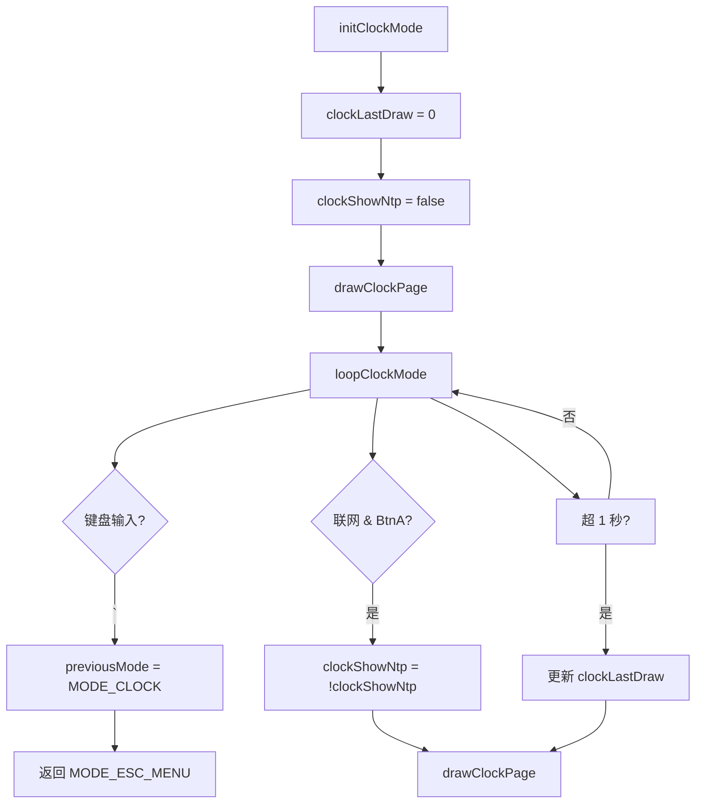
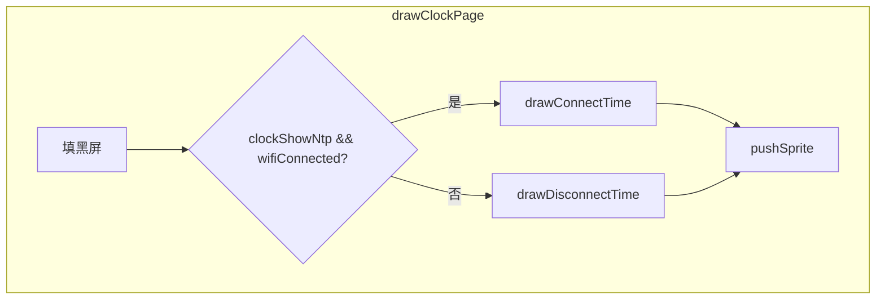

# ModeClock.ino

> 最后更新日期: 2026/07/29

## 作用

`ModeClock.ino` 实现**时间显示页面**，提供两种时间展示模式：
- **联网时**：显示 NTP 同步的完整日期和时间（青色），每 1 秒自动刷新。
- **断网时**：显示设备自开机以来的运行时长（红色），格式为 `HH:MM:SS`。

页面支持通过 BtnA 在"当前时间"和"运行时长"视图间切换（仅联网时有效）。

## 核心对象

| 对象 | 类型 | 说明 |
|------|------|------|
| `clockLastDraw` | `unsigned long` | 上次刷新时间戳（毫秒），用于控制 1 秒刷新间隔 |
| `clockShowNtp` | `bool` | `true` 显示 NTP 时间，`false` 显示运行时长（BtnA 切换） |

## 关键流程

### 联网显示（drawConnectTime）

| 元素 | 内容 | 颜色 | 字号 |
|------|------|------|:----:|
| 左上角 | "当前时间" | 深灰 | 1.0 |
| 中间偏上 | 日期 `YYYY-MM-DD` | 青色 | 1.4 |
| 中间偏下 | 时间 `HH:MM:SS` | 青色 | 2.5 |

### 断网显示（drawDisconnectTime）

| 元素 | 内容 | 颜色 | 字号 |
|------|------|------|:----:|
| 左上角 | "运行时长" | 深灰 | 1.0 |
| 中间 | `HH:MM:SS`（`millis()/1000`） | 红色 | 2.5 |

## 重要细节

- **NTP 同步中状态**：若 `getLocalTime()` 超时（10 ms 未返回），显示"时间同步中..."提示文字。
- **BtnA 切换**：仅在 `wifiConnected` 为 `true` 时生效；断网时始终显示运行时长。
- **ESC 返回**：按 `` ` `` 键设置 `previousMode = MODE_CLOCK` 后进入全局 ESC 菜单。
- **每秒刷新**：`loop` 中通过 `millis() - clockLastDraw >= 1000` 控制刷新间隔，确保时间显示实时更新。
- **字体**：中文字体使用 `efontCN_16`，时间数字使用大字体的 `drawString` 居中显示。

## 使用示例

### 查看 NTP 时间

1. 确保设备已连接 WiFi（`wifiConnected = true`）。
2. 从菜单进入时钟模式，页面自动显示当前日期和时间。
3. 按 **BtnA** 切换回运行时长视图，再按 **BtnA** 切回时间视图。
4. 按 `` ` `` 返回菜单。

### 查看运行时长（断网）

1. 未连接 WiFi 时进入时钟模式。
2. 页面直接显示红色 `HH:MM:SS` 格式的运行时长。
3. 按 **BtnA** 无效（始终显示运行时⻓）。
4. 页面每秒自动刷新。

## 注意事项

- NTP 时间依赖于 WiFi 连接；若 WiFi 不稳定，时间可能显示"时间同步中..."。
- `clockShowNtp` 初始值为 `false`，因此断网状态下首次进入时钟模式直接显示运行时长。
- 运行时长基于 `millis()` 计算，受 `millis()` 翻转影响（约 50 天归零）。
- 进入 ESC 菜单时设置 `previousMode = MODE_CLOCK`，在菜单中按 `` ` `` 退出时会重新进入时钟模式。
