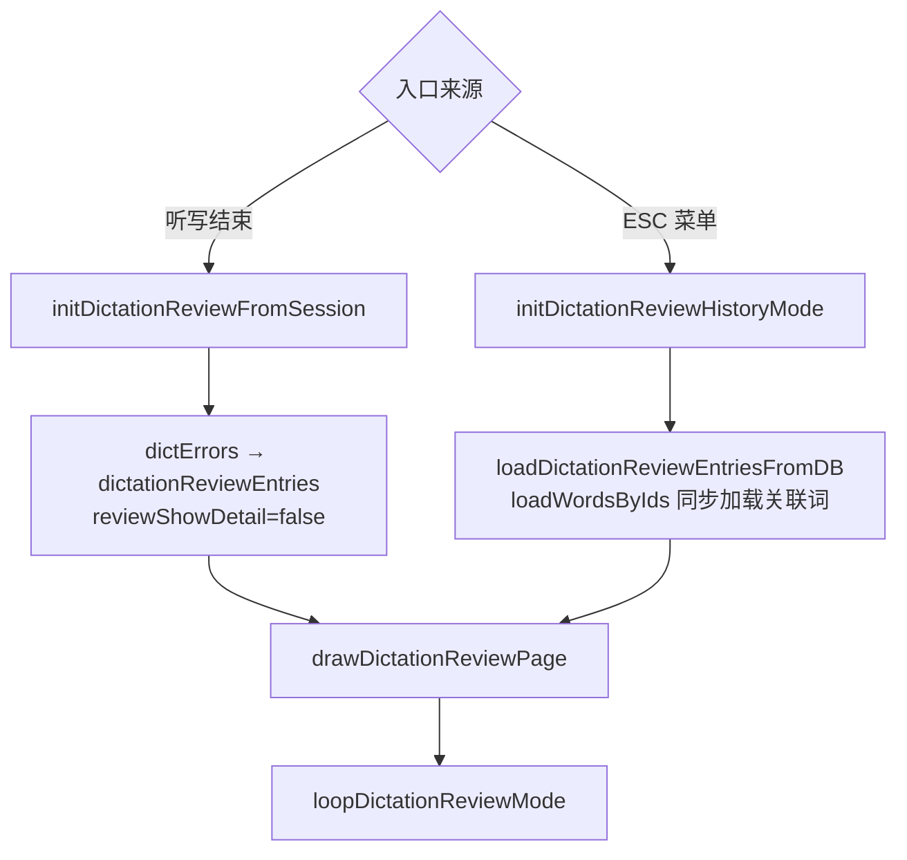

# ModeDictationReview.ino

> 最后更新日期: 2026/07/29

## 作用

`ModeDictationReview.ino` 实现**听写错误回顾页面**。支持两种入口：听写结束后查看本轮错题，以及从 ESC 菜单进入浏览当前语言下的历史错题。页面支持左右翻页、BtnA 切换单词详情/错误对照两种视图、Del 删除当前错题和 Fn 重播正确答案语音。

## 核心对象

| 对象 | 类型 | 说明 |
|------|------|------|
| `DictationReviewEntry` | `struct` | 错题回顾条目：`errorId`（错题主键）、`wordDbId`、`correct`（正确答案）、`wrong`（错误输入）、`createdAt`（错误时间） |
| `dictationReviewEntries` | `std::vector<DictationReviewEntry>` | 当前回顾页的错题列表 |
| `dictationReviewIndex` | `int` | 当前正在查看的条目索引 |
| `dictationReviewTitle` | `String` | 页面标题（"本轮错题"或"历史错题"） |
| `reviewShowDetail` | `bool`（静态内部变量） | `false`=错误对照视图，`true`=单词详情视图，由 BtnA 切换 |

## 核心函数

| 函数 | 作用 |
|------|------|
| `drawDictationReviewPage()` | 根据 `reviewShowDetail` 分发到 `drawReviewWordDetail()` 或 `drawReviewWordError()` |
| `drawReviewWordDetail()` | 绘制单词详情视图（复用听读模式的布局风格，显示完整单词信息） |
| `drawReviewWordError()` | 绘制错误对照视图（绿色正确答案 vs 红色错误输入） |
| `initDictationReviewFromSession()` | 用当前 `dictErrors` 初始化回顾页（听写结束入口） |
| `initDictationReviewHistoryMode()` | 从数据库加载历史错题初始化回顾页，同时调用 `loadWordsByIds()` 同步加载错题关联的词 |
| `loopDictationReviewMode()` | 错误回顾页主循环 |

## 关键流程

### 入口分发



### 主循环

```mermaid
flowchart TD
    A[loopDictationReviewMode] --> B{按键检测}
    B -->|ESC `| C[返回 ESC 菜单]
    B -->|BtnA| D[切换 reviewShowDetail<br/>drawDictationReviewPage]
    B -->|, / /| E[左右翻页<br/>drawDictationReviewPage]
    B -->|Del| F[deleteDictationError(errorId)<br/>删除条目后重绘]
    B -->|Fn| G[playAudioForWord 播放正确发音]
```

## 重要细节

### 两种视图

| 视图 | 触发方式 | 显示内容 |
|------|---------|---------|
| 错误对照 | 默认（`reviewShowDetail=false`） | 绿色正确答案居中偏上，红色错误输入居中偏下 |
| 单词详情 | BtnA 切换（`reviewShowDetail=true`） | 复用听读模式布局：显示完整单词信息（外文、音标/假名、中文释义） |

- **单词详情**视图会通过 `findWordByDbId()` 在 `words` 数组中查找对应单词。若词库未加载（无法找到单词），则仅显示正确答案。
- **错误对照**视图直接使用 `DictationReviewEntry` 中的 `correct` / `wrong` 文本，不依赖词库加载状态。

### 删除错题

- 按 Del 键会调用 `deleteDictationError(errorId)` 从数据库中删除当前错题记录。
- 删除后自动从 `dictationReviewEntries` 中移除该条目并重绘；若全部删完则显示空状态。

### 页面布局

- **标题**：左上角显示 `dictationReviewTitle`（"本轮错题"或"历史错题"）。
- **答案对照视图**：绿色大字正确答案（居中偏上），红色大字错误输入（居中偏下）。
- **单词详情视图**：外文（cyan）+ 音标/假名 + 中文释义（yellow）。
- **页码**：底部居中显示 `当前/总数`。
- **空状态**：无错题时显示"没有错误记录"。

### 两种数据来源

| 来源 | 入口 | 数据 |
|------|------|------|
| 本轮错题 | 听写结束自动跳转 | 内存中的 `dictErrors` → `DictationReviewEntry` |
| 历史错题 | ESC 菜单 → "查看过往错题" | 数据库 `*_dictation_errors` 表 |

`initDictationReviewFromSession()` 直接将内存中的 `dictErrors` 转为页面条目，无需再次查询数据库。`initDictationReviewHistoryMode()` 在加载错题后调用 `loadWordsByIds()` 同步加载关联单词，确保详情视图可用。

## 使用示例

### 听写结束后回顾错题

1. 完成一轮听写测试，进入总结页面。
2. 按 Enter 进入错题回顾（若有错题）。
3. 按 `/` 查看下一个错题，按 `,` 回看上一个。
4. 按 **BtnA** 在错误对照和单词详情两种视图之间切换，直观对比错误与正确信息。
5. 按 **Del** 删除当前错题（从数据库移除）。
6. 按 `Fn` 重播正确答案的语音。
7. 按 `` ` ``（ESC）返回菜单。

### 从菜单浏览历史错题

1. 任意模式按 `` ` `` 呼出 ESC 菜单。
2. 按 `.` 高亮"查看过往错题"，按 Enter。
3. 页面加载历史错题列表，按 `,/` 翻页浏览。
4. 按 BtnA 切换单词详情查看完整词条信息，按 Del 可删除不再需要的错题记录。
5. 按 `` ` `` 返回菜单。

## 注意事项

- 若无错题记录，页面显示空状态提示，`,` `/` `BtnA` `Del` `Fn` 键均无效果。
- 历史错题从数据库加载，若加载失败会显示"错题加载失败"并返回空列表。
- `initDictationReviewFromSession()` 会跳过 `wordIndex` 越界的错题条目。
- 从历史错题入口进入时，`loadWordsByIds()` 可能因数据库问题失败，此时详情视图仅显示正确答案而不会显示完整单词信息。
