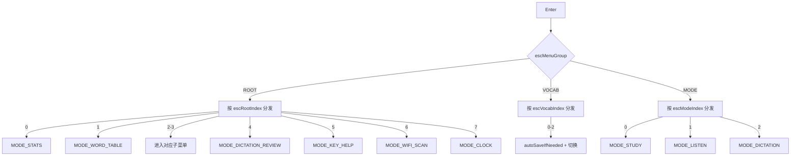

# ModeEscMenu.ino

> 最后更新日期: 2026/09/01

## 作用

`ModeEscMenu.ino` 实现应用程序的 **全局 ESC 菜单**。用户在学习、听读、听写等模式中按 `` ` ``（ESC）键即可呼出，提供学习统计、词库管理、模式切换、查看错题、按键帮助、WiFi 连接、时间等入口。菜单采用**三层分组结构**：根菜单 + 词库子菜单 + 模式子菜单。

## 核心对象

### 菜单分组

| 对象 | 类型 | 说明 |
|------|------|------|
| `EscMenuGroup` | `enum` | `ESC_MENU_ROOT` / `ESC_MENU_VOCAB` / `ESC_MENU_MODE` |
| `escMenuGroup` | `EscMenuGroup` | 当前菜单分组状态 |

### 菜单项数组

| 对象 | 类型 | 项数 | 说明 |
|------|------|:----:|------|
| `escRootItems` | `std::vector<String>` | 8 | 根菜单：学习统计、当前词表、词库相关 >、模式切换 >、查看过往错题、按键帮助、WiFi 连接、时间 |
| `escVocabItems` | `std::vector<String>` | 3 | 词库子菜单：重新选择语言、重新选择分类、重新选择词源 |
| `escModeItems` | `std::vector<String>` | 3 | 模式子菜单：进入学习模式、进入听读模式、进入听写模式 |

### 游标与滚动

| 对象 | 类型 | 说明 |
|------|------|------|
| `escRootIndex` / `escRootScroll` | `int` | 根菜单的选中索引与滚动偏移 |
| `escVocabIndex` / `escVocabScroll` | `int` | 词库子菜单的选中索引与滚动偏移 |
| `escModeIndex` / `escModeScroll` | `int` | 模式子菜单的选中索引与滚动偏移 |
| `previousMode` | `AppMode` | 进入菜单前的模式，退出时恢复 |

### 辅助函数

| 函数 | 作用 |
|------|------|
| `currentEscItems()` | 根据 `escMenuGroup` 返回当前分组的菜单项数组引用 |
| `currentEscIndex()` | 返回当前分组对应的选中索引引用 |
| `currentEscScroll()` | 返回当前分组对应的滚动起点引用 |
| `escMenuTitle()` | 返回当前分组的标题（"菜单"/"词库相关"/"模式切换"） |
| `returnFromEscMenu()` | 自动保存后根据 `previousMode` 恢复对应模式 |

## 菜单项索引

### 根菜单（`escRootItems`）

| 索引 | 菜单项 | 操作 |
|:----:|--------|------|
| 0 | 学习统计 | 进入 `MODE_STATS` |
| 1 | 当前词表 | 进入 `MODE_WORD_TABLE` |
| 2 | 词库相关 > | 按 `/` 或 Enter 进入词库子菜单 `ESC_MENU_VOCAB` |
| 3 | 模式切换 > | 按 `/` 或 Enter 进入模式子菜单 `ESC_MENU_MODE` |
| 4 | 查看过往错题 | 进入 `MODE_DICTATION_REVIEW` |
| 5 | 按键帮助 | 进入 `MODE_KEY_HELP` |
| 6 | WiFi 连接 | 进入 `MODE_WIFI_SCAN` |
| 7 | 时间 | 进入 `MODE_CLOCK` |

### 词库子菜单（`escVocabItems`）

| 索引 | 菜单项 | 操作 |
|:----:|--------|------|
| 0 | 重新选择语言 | 自动保存后进入 `MODE_LANG_SELECT` |
| 1 | 重新选择分类 | 自动保存后进入 `MODE_CLASSIFY_SELECT` |
| 2 | 重新选择词源 | 自动保存后进入 `MODE_FILE_SELECT` |

### 模式子菜单（`escModeItems`）

| 索引 | 菜单项 | 操作 |
|:----:|--------|------|
| 0 | 进入学习模式 | 进入 `MODE_STUDY` |
| 1 | 进入听读模式 | 进入 `MODE_LISTEN` |
| 2 | 进入听写模式 | 进入 `MODE_DICTATION` |

## 关键流程

### 三层菜单导航

```mermaid
flowchart TD
    A[按 ESC] --> B[initEscMenuMode<br/>escMenuGroup=ROOT]
    B --> C[drawEscMenu]
    C --> D{用户按键}

    D -->|`| E{当前分组?}
    E -->|ROOT| F[returnFromEscMenu<br/>autoSave + 恢复模式]
    E -->|子菜单| G[escMenuGroup=ROOT<br/>drawEscMenu]

    D -->|,| H{当前分组?}
    H -->|ROOT| I[无操作]
    H -->|子菜单| G

    D -->|/| J{在 ROOT 且<br/>选中"词库相关"?}
    J -->|是| K[escMenuGroup=VOCAB<br/>drawEscMenu]
    J -->|否| L{在 ROOT 且<br/>选中"模式切换"?}
    L -->|是| M[escMenuGroup=MODE<br/>drawEscMenu]

    D -->|; / .| N[navigateMenu 上/下移动]
    N --> O[drawEscMenu]

    D -->|Enter| P{根据分组和索引分发}
```

### Enter 分发逻辑



## 重要细节

- **退出菜单**：根菜单下按 `` ` `` 时触发 `returnFromEscMenu()`，先调用 `autoSaveIfNeeded()`，然后根据 `previousMode` 恢复对应模式（学习/听读/听写/错题回顾/分类选择/时钟等）。
- **子菜单导航**：根菜单中索引 2/3 的项带 `>` 标记，表示可展开。按 `/` 或 Enter 进入对应子菜单；在子菜单中按 `,` 或 `` ` `` 返回根菜单。
- **各分组独立游标**：不同分组拥有独立的 `Index` 和 `Scroll` 变量，切换分组时保留各自的光标位置。
- **切换词源/语言/分类**：在跳转前自动保存当前词库进度，防止丢失。
- **新增入口**：根菜单新增"当前词表"（`MODE_WORD_TABLE`）和"时间"（`MODE_CLOCK`）。

## 使用示例

### 从子菜单切换模式

1. 学习模式中按 `` ` `` 呼出菜单。
2. 按 `.` 高亮"模式切换 >"，按 Enter 或 `/` 进入模式子菜单。
3. 在子菜单中按 `.` 选择"进入听写模式"，按 Enter 启动听写。
4. 听写中再按 `` ` `` 返回菜单。

### 重新选择词源

1. 任意模式按 `` ` `` 呼出菜单。
2. 高亮"词库相关 >"，按 `/` 进入词库子菜单。
3. 选择"重新选择词源"，自动保存后进入文件选择界面。
4. 选择新词库后自动开始学习。

### 查看历史错题

1. 学习模式中按 `` ` `` 呼出菜单。
2. 按 `.` 高亮"查看过往错题"，按 Enter。
3. 左/右翻页浏览历史错误记录，按 Fn 重播语音。
4. 按 `` ` `` 返回菜单。

## 注意事项

- 各分组滚动位置独立保存：`escRootScroll`、`escVocabScroll`、`escModeScroll`。
- 从菜单进入学习/听读/听写等模式时都会调用对应的 `init*` 函数重新初始化，包括学习模式中通过 `pickWeightedRandom()` 重新抽取 `wordIndex`。
- 菜单列表超过 `visibleLines`（4 项）时，`drawTextMenu()` 会自动分页显示。
- 菜单不再包含独立的"保存进度"选项；自动保存机制通过 `markScoreDirty()` / `autoSaveIfNeeded()` 在切换词源/语言/退出时自动触发。
