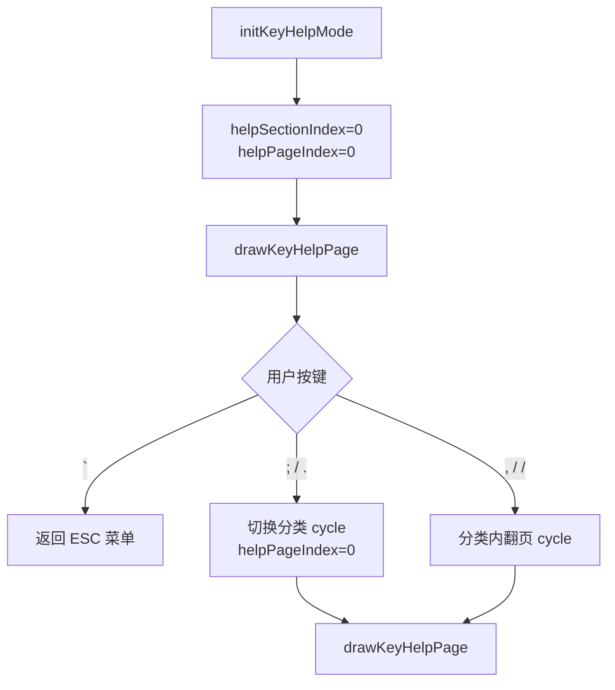

# ModeKeyHelp.ino

> 最后更新日期: 2026/07/29

## 作用

`ModeKeyHelp.ino` 实现**按键帮助页面**。采用"分类 + 分类内分页"的双层结构，展示各功能模式下的按键说明。用户可通过 `;/.` 切换分类、`,//` 在分类内翻页，帮助快速查阅设备交互方式。

## 核心对象

| 对象 | 类型 | 说明 |
|------|------|------|
| `helpSections` | `std::vector<HelpSectionData>` | 所有帮助分类的列表 |
| `helpSectionIndex` | `int` | 当前选中的分类索引 |
| `helpPageIndex` | `int` | 当前分类内的页码 |
| `HelpSectionData` | `struct` | 分类数据结构：`section`（分类名）+ `pages`（分页二维表格） |

## 帮助分类与内容

帮助系统共包含 6 个分类（按 `;/.` 循环切换）：

### 1. 按键帮助

| 按键 | 功能 |
|------|------|
| `;` / `.` | 切换帮助分类 |
| `,` / `/` | 当前分类翻页 |

### 2. 通用

| 按键 | 功能 |
|------|------|
| ESC（`` ` ``） | 打开/关闭菜单 |

### 3. 学习模式（共 2 页）

**第 1 页：**

| 按键 | 功能 |
|------|------|
| BtnA | 单词页翻卡/例句中切换中译 |
| Enter | 记住（score +1） |
| Del | 不熟（score -1） |

**第 2 页：**

| 按键 | 功能 |
|------|------|
| `,` / `/` | 左右循环切换页面 |
| `;` / `.` | 音量加/减 |
| Fn | 播放发音 |

### 4. 听写模式（共 3 页）

**第 1 页：**

| 按键 | 功能 |
|------|------|
| 字母键 | 输入答案 |
| Enter | 提交答案 |
| Del | 删除字符 |

**第 2 页：**

| 按键 | 功能 |
|------|------|
| Shift | 平/片假名切换 |
| `;` | 确认当前假名 |
| Fn | 重播当前发音 |

**第 3 页：**

| 按键 | 功能 |
|------|------|
| `;` / `.` | 音量加/减 |
| Fn | 播放发音 |

### 5. 当前词表

| 按键 | 功能 |
|------|------|
| `;` / `.` | 切换分数组 |
| `,` / `/` | 当前分组翻页 |

### 6. 错题回顾

| 按键 | 功能 |
|------|------|
| `,` / `/` | 切换错题 |
| BtnA | 单词详情/错误对照 |
| Fn | 重播正确发音 |
| Del | 删除当前错题 |

## 关键流程

## 重要细节

- **双层结构**：`;/.` 切换分类（6 个分类循环），`,//` 在当前分类内翻页（每个分类可有多页）。
- **页面渲染**：每个页面使用 `drawSimpleTable()` 渲染，表头为"按键"和"功能"。
- **右上角指示**：显示"分类名 当前页/总页数"，如"学习模式 1/2"、"错题回顾 1/1"。
- **翻页是循环的**：第一页按 `,` 跳到最后一页；最后一个分类按 `.` 跳到第一个分类。

## 使用示例

1. 在 ESC 菜单中选择"按键帮助"。
2. 按 `.` 切换到"学习模式"分类，查看其第 1 页的按键说明。
3. 按 `/` 翻到第 2 页查看更多学习模式操作。
4. 按 `.` 切换到"错题回顾"分类，查看 BtnA 和 Del 的操作说明。
5. 按 `` ` `` 返回菜单。

## 注意事项

- 帮助页面仅展示静态文本，不会触发任何数据修改或音频播放。
- 若后续新增模式或修改按键映射，需在 `helpSections` 中添加或更新对应的 `HelpSectionData`。
- 当前共 6 个分类，`helpSections` 数据定义在 `globals.cpp` 中。
