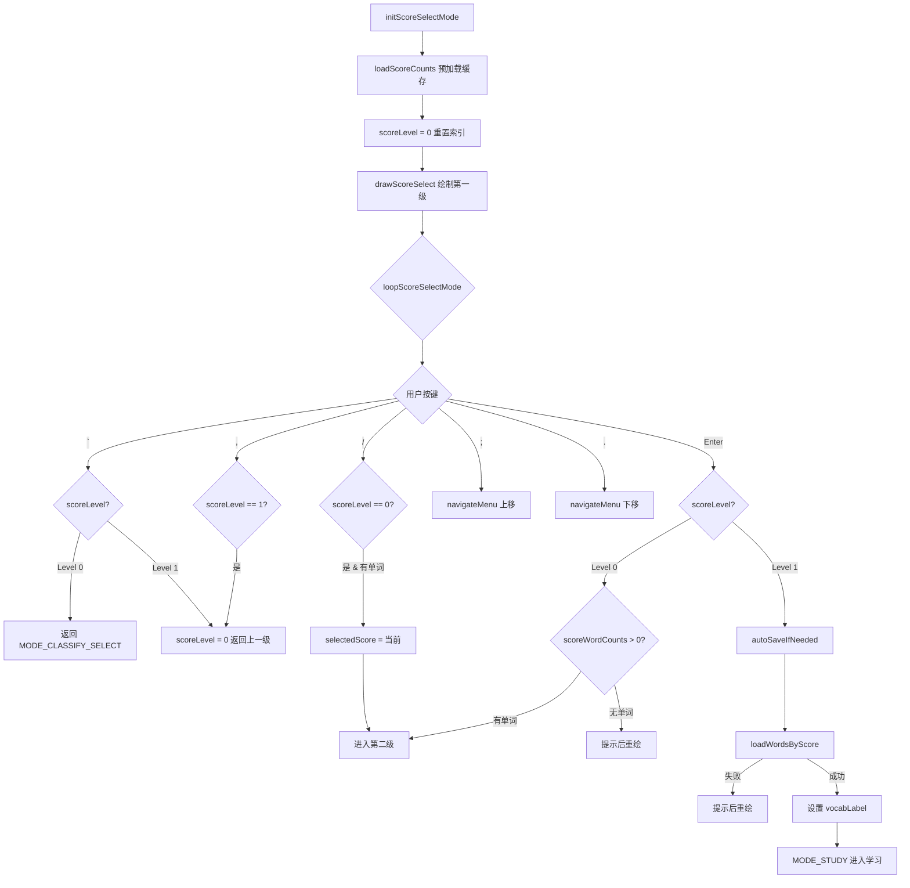

# ModeScoreSelect.ino

> 最后更新日期: 2026/07/29

## 作用

`ModeScoreSelect.ino` 实现**按 Score 分类的词库选择模式**，是分类方式中选择"按Score分类"后的子模式。采用两级选择结构：

1. **第一级**：选择 Score 级别（1~5），显示各等级单词数量及 `>` 标记。
2. **第二级**：选择分组（每组 ≤50 词），加载该组词库后进入学习模式。

## 核心对象

| 对象 | 类型 | 说明 |
|------|------|------|
| `scoreWordCounts` | `int[6]` | 下标 1~5 分别缓存各级别的单词总数（索引 0 未使用） |
| `scoreLevel` | `int` | `0` 表示第一级（选分数），`1` 表示第二级（选分组） |
| `scoreListIndex` | `int` | 第一级菜单中当前高亮索引（0~4 对应 score 1~5） |
| `scoreListScroll` | `int` | 第一级菜单滚动偏移 |
| `selectedScore` | `int` | 当前选中的 Score 值（1~5） |
| `groupListIndex` | `int` | 第二级菜单中当前高亮索引 |
| `groupListScroll` | `int` | 第二级菜单滚动偏移 |

## 关键流程



## 重要细节

### 预加载缓存

- `initScoreSelectMode()` 在进入时调用 `loadScoreCounts(scoreWordCounts)` 一次性查询各级单词数量。
- 缓存后不再访问数据库，避免每次按键都查询。
- 分组计算基于 `scoreWordCounts[selectedScore]`，每组最多 50 个单词。

### 第二级分组计算

```
groupCount = (total + 49) / 50
```

每个分组的显示格式为 `start-end`（1-based），如 `1-50`、`51-100`。

### 键盘操作对照

| 按键 | 第一级 | 第二级 |
|------|--------|--------|
| `` ` `` | 返回分类方式选择 | 返回第一级 |
| `,` | 无效 | 返回第一级 |
| `/` | 有单词时直接进入分组选择 | 无效 |
| `;` | 上移光标 | 上移光标 |
| `.` | 下移光标 | 下移光标 |
| Enter | 选中分数 → 进入分组选择 | 加载词库 → 进入学习模式 |

### 加载失败处理

- 选中 Score 但该级别无单词时显示红色提示"该级别无单词"（600 ms）后重绘菜单。
- `loadWordsByScore()` 失败时显示红色提示"词库加载失败"（600 ms）后重绘菜单。

## 使用示例

### 选择 Score 3 的词组进入学习

1. 在第一级看到各等级单词数：`Level 1 (0)`、`Level 2 (12) >`、`Level 3 (45) >`、`Level 4 (30) >`、`Level 5 (8) >`。
2. 按 `.` 下移到 `Level 3`，按 **Enter** 进入第二级。
3. 分组列表：`1-45`（由于只有 45 个单词，未超过 50 所以一个分组）。
4. 按 **Enter** 加载词库，自动进入学习模式。

### 按 `/` 快速跳转

1. 在第一级高亮 `Level 3` 时按 `/` 键。
2. 直接进入第二级分组选择界面。
3. 按 `` ` `` 或 `,` 返回第一级。

## 注意事项

- `scoreWordCounts` 索引 0 保留未用，实际使用 1~5。
- 分组计算使用 `(total + 49) / 50` 实现向上取整。
- `vocabLabel` 格式为 `"分数/起始-结束"`，如 `"3/1-45"`，用于标识当前词库来源。
- 进入学习模式前调用 `autoSaveIfNeeded()` 确保前一个模式的学习进度已保存。
