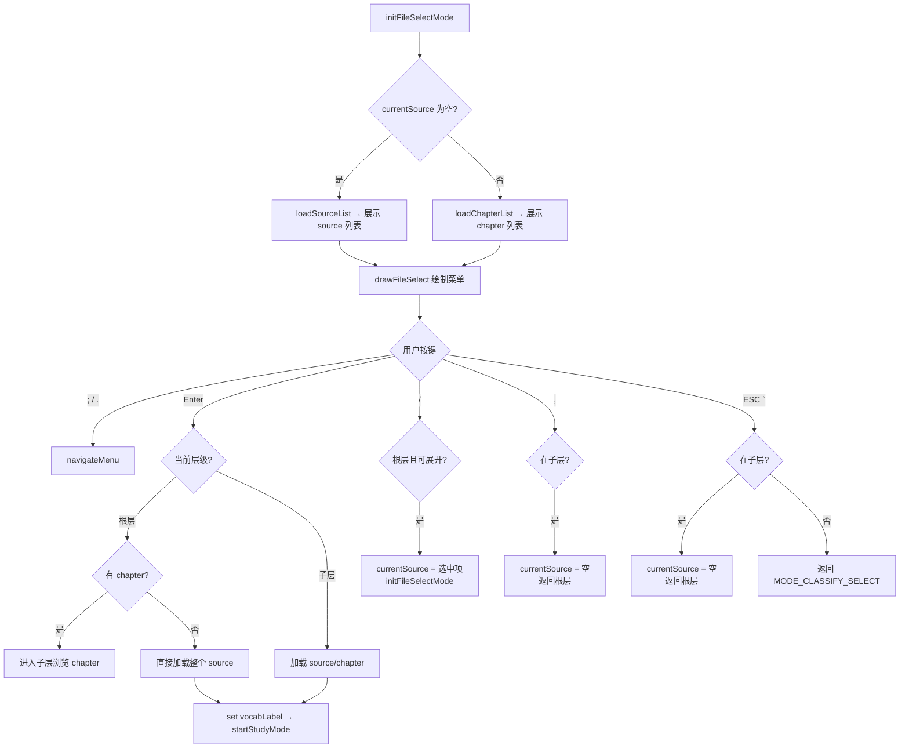

# ModeSourceSelect.ino

> 最后更新日期: 2026/09/01

## 作用

`ModeSourceSelect.ino` 实现**词库浏览器**。已在底层改为数据库驱动，不再直接浏览 SD 卡 JSON 文件。用户在分类选择后进入该模式，浏览 SQLite 数据库中的 source（词源）和 chapter（章节），选中后加载并进入学习模式。ESC 返回分类选择模式。

## 核心对象

| 对象 | 类型 | 说明 |
|------|------|------|
| `files` | `std::vector<String>` | 当前层级下的 source 或 chapter 列表 |
| `fileExpandable` | `std::vector<bool>` | 标记 source 是否可展开进入 chapter 子层 |
| `fileIndex` | `int` | 当前选中索引 |
| `fileScroll` | `int` | 当前滚动偏移 |
| `selectedSource` | `String` | 选中的词库来源 |
| `selectedChapter` | `String` | 选中的章节，空表示整个 source |

> `currentDir` 和 `selectedFilePath` 已在重构中移除，不再使用。

## 关键流程

## 重要细节

### Source/Chapter 树形结构

浏览状态由全局变量 `currentSource` 维护：
- **根层**（`currentSource` 为空）：显示所有 source 列表
- **子层**（`currentSource` 为某 source）：显示该 source 的 chapter 列表

根据 `sourceHasChapters()` 判断 source 是否有子划分。无 chapter 的 source 直接加载。

### 词库加载与标签

选中词库后：
- 设置 `selectedSource` 和 `selectedChapter`
- 调用 `loadWordsBySource()` 从数据库加载
- 设置 `vocabLabel` 为 `selectedSource/chapter` 格式用于显示
- 自动保存上一词库的进度

### 导航操作

| 按键 | 根层操作 | 子层操作 |
|------|---------|---------|
| `;` / `.` | 上/下移动光标 | 同左 |
| `/` | 进入可展开 source 的子层 | 无操作 |
| `,` | 无操作 | 返回根层 |
| `` ` `` | 返回 `MODE_CLASSIFY_SELECT` | 先返回根层，再按一次返回分类选择 |

## 使用示例

### 浏览并加载词库

1. 选择语言后进入分类选择，选择"按词源分类"。
2. 进入根层看到所有 source 列表（如 `Demo_Basics`、`N5`）。
3. 按 `;/.` 上下移动，按 `/` 或 Enter 进入有 `>` 标记的 source。
4. 进入子层浏览章节（如 `Unit_1`、`Unit_2`）。
5. 按 Enter 选中 chapter 开始学习。
6. 在子层按 `,` 返回根层。
7. 按 `` ` `` 返回分类选择模式。

## 注意事项

- 真实的数据加载依据是 `selectedSource` 和 `selectedChapter`，不再依赖路径字符串。
- 空列表时显示"没有词库数据"提示。
- 从文件选择切换词库时，`loadWordsBySource()` 会先自动保存旧词库进度。
- 有 chapter 的 source 在列表中显示 `>` 后缀（如 `Demo_Basics >`），可展开浏览。
