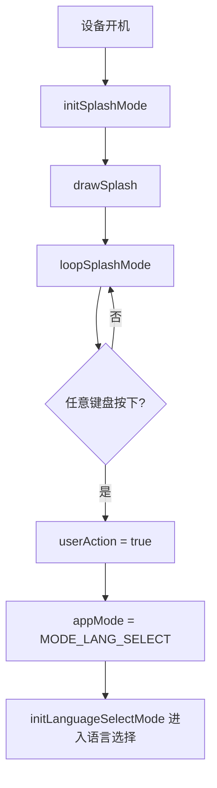

# ModeSplash.ino

> 最后更新日期: 2026/07/29

## 作用

`ModeSplash.ino` 实现设备**开机启动画面**，在 M5Cardputer 屏幕上展示 WordCardputer 的 ASCII 艺术 Logo。按任意键盘键后进入语言选择界面，是用户启动应用后看到的第一个页面。

## 核心对象

| 对象 | 类型 | 说明 |
|------|------|------|
| `LOGO_LINES` | `const char *[]` | 5 行 ASCII Logo 字符数组 |
| `LOGO_LINE_COUNT` | `const int` | Logo 行数（由数组自动计算） |

### ASCII Logo 内容

```
 _       __               __
| |     / /___  _________/ /
| | /| / / __ \/ ___/ __  /
| |/ |/ / /_/ / /  / /_/ /
|__/|__/\____/_/   \__,_/
```

## 关键流程



## 重要细节

- **Logo 布局**：5 行 ASCII 文字垂直居中偏上（`(ch - logoTotalH) / 2 - 12`），字号 1.0。
- **底部提示**：暗绿色（`0x7BEF`）显示 `"Press any key"`，位于屏幕底部上方 24 像素处。
- **BLACK 背景**：`fillScreen(BLACK)` 确保屏幕清除干净。
- **切换条件**：检测有按键输入（`M5Cardputer.Keyboard.isPressed()`）即跳转，不等待特定按键。
- **没有退出键**：启动画面不接受 `` ` `` 或其他退出操作，唯一出口是按键后进入语言选择。

## 使用示例

### 正常启动流程

1. M5Cardputer 开机后自动加载启动画面。
2. 屏幕居中显示 WordCardputer 的 ASCII Logo。
3. 底部显示 `"Press any key"` 提示。
4. 按任意字母、数字或功能键。
5. 进入语言选择界面（`MODE_LANG_SELECT`）。

### 开机后不操作

- 启动画面停留在屏幕，不超时、不自动跳转。
- 系统空闲超时机制（`lastActivityTime`）可能在启动时触发屏幕变暗，但不会退出启动画面。

## 注意事项

- 启动画面是整个应用运行的第一个模式（`AppMode` 枚举值为 `MODE_SPLASH`），在 `setup()` 中初始化。
- 此模式不加载任何外部数据，不访问 SD 卡或 WiFi，确保快速展示。
- 切换到语言选择后无法直接返回启动画面；如需再次查看需重启设备。
