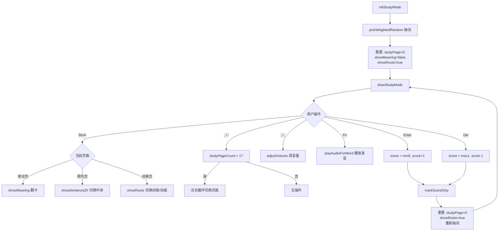
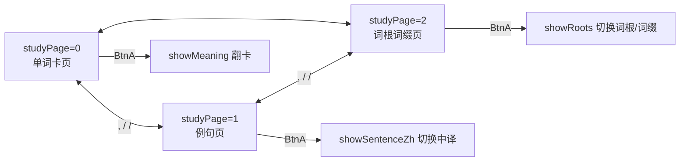

# ModeStudy.ino

> 最后更新日期: 2026/07/29

## 作用

`ModeStudy.ino` 实现 **Anki 风格的双面闪卡学习模式**，并扩展为**三页系统**：单词卡页、例句页、词根词缀页。每次抽取一个单词，随机决定先显示外语（Side A）还是中文释义（Side B），用户通过翻卡、查看例句与词根词缀、打分、播放音频来强化记忆。

## 核心对象

| 对象 | 类型 | 说明 |
|------|------|------|
| `showMeaning` | `bool` | 是否已翻卡显示释义/原文 |
| `showAnkiSideA` | `bool` | `true`=先显示外语，`false`=先显示中文 |
| `wordIndex` | `int` | 当前学习的单词在 `words` 中的索引 |
| `studyPage` | `int` | 当前学习页面：0=单词卡页、1=例句页、2=词根词缀页 |
| `showSentenceZh` | `bool` | 例句页中是否显示中文翻译 |
| `showRoots` | `bool` | 词根词缀页中是否显示词根（`true`）或词缀（`false`） |

## 核心函数

### 页面判断与计数

| 函数 | 作用 |
|------|------|
| `studyHasExample(const Word &w)` | 判断单词是否有例句（`sentence` 或 `sentenceZh` 非空） |
| `studyHasRootAffix(const Word &w)` | 判断单词是否有词根或词缀（`root` 或 `affix` 非空） |
| `studyPageCount(const Word &w)` | 返回单词的实际页数（1~3 页，根据可用信息动态计算） |

### 绘制函数

| 函数 | 作用 |
|------|------|
| `drawStudyWord(const Word &w)` | 绘制单词卡页，根据语言分发到英语/日语闪卡 |
| `drawEnglishWord(const Word &w)` | 绘制英语闪卡（外文/音标 + 翻卡中文） |
| `drawJapaneseWord(const Word &w)` | 绘制日语闪卡（假名/声调 + 翻卡中文） |
| `drawStudySentence(const Word &w)` | 绘制例句页，根据语言分发 |
| `drawEnglishSentence(const Word &w)` | 绘制英语例句（原文/中文翻译） |
| `drawJapaneseSentence(const Word &w)` | 绘制日语例句（原文/中文翻译） |
| `drawStudyRootAffix(const Word &w)` | 绘制词根/词缀表格页，使用 `drawSimpleTable()` |

### 生命周期函数

| 函数 | 作用 |
|------|------|
| `initStudyMode()` | 初始化学习模式，设置 `studyPage=0`、`showRoots=true`，抽词后绘制 |
| `drawStudyMode()` | 根据 `studyPage` 分发到对应绘制函数，并在左上角显示 Score |
| `loopStudyMode()` | 学习模式主循环，处理键盘输入和 BtnA 操作 |

## 关键流程

### 学习主循环

### 三页系统

页数根据单词可用信息动态计算：
- 无例句且无词根词缀：仅单词卡页（1 页）
- 有例句无词根词缀：单词卡页 + 例句页（2 页）
- 无例句有词根词缀：单词卡页 + 词根词缀页（2 页）
- 两者均有：单词卡页 + 例句页 + 词根词缀页（3 页）

## 重要细节

### BtnA 多态行为

BtnA 的行为因当前页面而异：
| 页面 | BtnA 操作 |
|------|----------|
| 单词卡页（`studyPage=0`） | 翻卡，切换 `showMeaning` 显示释义 |
| 例句页（`studyPage=1`） | 切换中译显示 `showSentenceZh`（需有例句数据） |
| 词根词缀页（`studyPage=2`） | 切换 `showRoots` 在词根和词缀之间切换 |

### 页面切换

- `,` / `/` 键在可用页面之间循环切换，`studyPageCount()` 根据单词数据动态计算页数。
- 评分（Enter/Del）后重置 `studyPage = 0`、`showRoots = true`。

### Side A / Side B 显示内容

| 语言 | Side A（外语优先） | Side B（中文优先） |
|------|-------------------|-------------------|
| 英语 | 主显 `en` + `phonetic`（IPA 转 ASCII） | 主显 `zh` + `pos`，翻卡后显示 `en` |
| 日语 | 主显 `jp` + `tone` | 主显 `zh` + `kanji`，翻卡后显示 `jp` |

- **随机翻面**：每次评分后，`showAnkiSideA = random(2)`，实现双向回忆训练。
- **分数边界**：`Enter` 最多加至 5，`Del` 最少减至 1。
- **自动保存**：每次评分调用 `markScoreDirty()`，累计 5 次后自动回写 SD 卡。
- **首次进入英语**：`initStudyMode()` 会强制 `showAnkiSideA = true`，避免空中文优先时无法显示内容。

### 词根词缀查询

- 词根词缀页通过 `loadRootAffixNames()` 从数据库 `en_roots` / `en_affixes` 表查询名称和释义。
- 使用 `drawSimpleTable()` 渲染为两列表格（名称 / 释义）。
- 若当前显示类别为空则自动切换到另一类别；两者皆空时显示"无数据"。

## 使用示例

### 学习一个单词

1. 屏幕显示 `apple` 与音标 `/ˈæpəl/`。
2. 想不起来时按 **BtnA** 翻卡，显示中文"苹果"。
3. 按 `/` 切换到例句页查看 `This is an apple.`。
4. 按 `/` 继续切换到词根词缀页查看词根信息。
5. 按 **BtnA** 在词根/词缀间切换查看。
6. 按 `,` 回到单词卡页。
7. 按 **Enter** 标记"记住"，分数 +1，系统抽取下一个单词。
8. 若记错了，按 **Del** 标记"不熟"，分数 -1。
9. 随时按 **Fn** 重听发音，按 **;** / **.** 调整音量。

## 注意事项

- 进入学习模式前必须已通过文件选择加载词库，否则 `words.empty()` 会显示"未找到单词数据"。
- 评分后立即重新抽词并重置页面到第 0 页（单词卡页）。
- 右上角仅在音量调节后 2 秒内显示当前音量值。
- 进入学习模式（ESC 菜单）和评分后都会重置 `studyPage=0`，确保始终从单词卡页开始。
