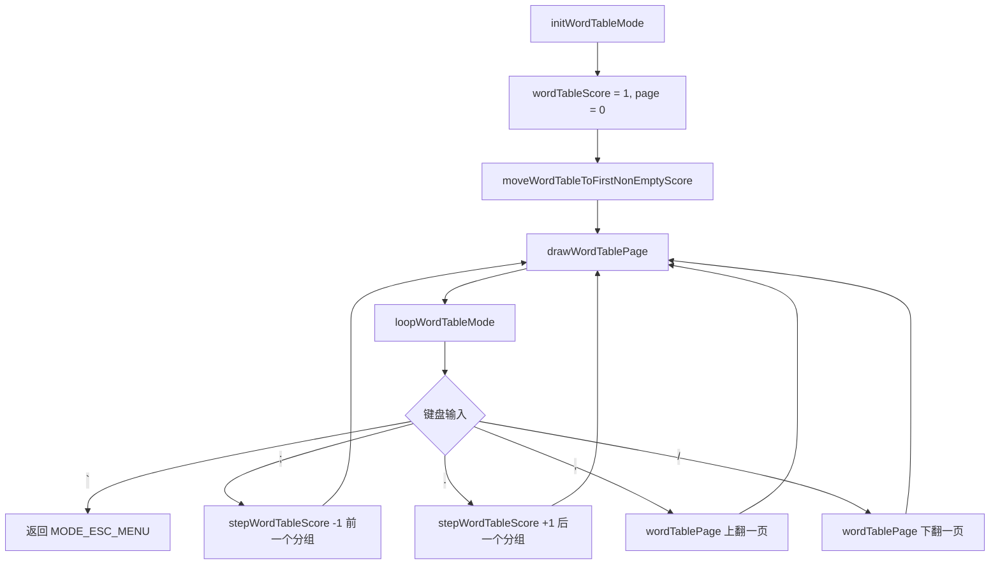

# ModeWordTable.ino

> 最后更新日期: 2026/07/29

## 作用

`ModeWordTable.ino` 实现**当前词库按分数词表展示模式**。将已加载词库的单词按 score=1~5 分组，每个分组使用多页表格在小屏幕上展示单词的外语表记、中文释义和当前分数，便于快速浏览当前范围内各分数段的词汇分布。

## 核心对象

| 对象 | 类型 | 说明 |
|------|------|------|
| `wordTableScore` | `int` | 当前显示的 Score 分组（1~5） |
| `wordTablePage` | `int` | 当前显示的页码（0-based） |
| `wordTableRowsPerPage` | `const int` | 每页显示的行数（由 `globals.cpp` 定义） |
| `wordTableFilteredIndices` | `std::vector<int>` | 当前 Score 分组下符合过滤条件的单词索引列表 |

## 核心函数

| 函数 | 说明 |
|------|------|
| `initWordTableMode()` | 初始化词表模式，定位到第一个非空分组并绘制页面 |
| `drawWordTablePage()` | 绘制当前词表页面（表格形式） |
| `loopWordTableMode()` | 主循环，处理键盘输入和翻页/切换分组 |
| `rebuildWordTableFilteredIndices()` | 重建当前 Score 分组的单词索引列表 |
| `wordTableTotalPages()` | 计算当前分组总页数 |
| `switchWordTableScore(int nextScore)` | 切换到指定 Score 分组（范围限制 1~5）并重置页码 |
| `stepWordTableScore(int delta)` | 向前/向后循环跳转到下一个非空分组 |
| `moveWordTableToFirstNonEmptyScore()` | 将分组定位到第一个非空 Level |

## 关键流程



### 过滤索引重建

```mermaid
flowchart TD
    A[rebuildWordTableFilteredIndices]
    A --> B[清空 wordTableFilteredIndices]
    B --> C[遍历 words 列表]
    C --> D{words[i].score == wordTableScore?}
    D -->|是| E[追加索引 i]
    D -->|否| F[跳过]
    E --> G[继续遍历]
    F --> G
```

### 分组切换与分页

```mermaid
flowchart TD
    subgraph stepWordTableScore
        S1[delta = -1 或 +1] --> S2[尝试最多 5 次]
        S2 --> S3[nextScore 循环 1~5]
        S3 --> S4[switchWordTableScore]
        S4 --> S5{过滤后非空?}
        S5 -->|是| S6[返回]
        S5 -->|否| S2
        S2 --> S7[所有分组为空, 恢复到原始分组]
    end

    subgraph wordTableTotalPages
        P1{filteredIndices 为空?}
        P1 -->|是| P2[返回 1]
        P1 -->|否| P3[(size + rowsPerPage -1) / rowsPerPage]
    end
```

## 重要细节

### 表格内容

每页表格包含三列：

| 列名 | 内容 | 语言变化 |
|------|------|---------|
| 外语 | 当前语言的表记（英文/日语） | `LANG_EN` 时显示 `w.en`，否则显示 `w.jp` |
| 中文 | 中文释义 | `w.zh` |
| 分数 | 当前 Score（1~5） | `w.score` |

### 分组切换逻辑

- `;` 切换到前一个非空分组，`.` 切换到后一个非空分组。
- `stepWordTableScore()` 最多尝试 5 次，若所有分组均为空则恢复到原始分组。
- `switchWordTableScore()` 使用 `constrain()` 将 `nextScore` 限制在 1~5 范围。

### 初始化定位

- `moveWordTableToFirstNonEmptyScore()` 从 score=1 开始查找第一个有单词的分组。
- 若所有分组都为空，停留在 score=1。

### 分页

- 分页基于 `wordTableFilteredIndices.size()` 和 `wordTableRowsPerPage` 计算。
- `,` 上翻一页，`/` 下翻一页，支持循环翻页（`% totalPages`）。
- 当分组无单词时 `wordTableTotalPages()` 返回 1。

### 空词库检测

- `drawWordTablePage()` 在 `words.empty()` 时显示红色提示"请先加载词库"并提前返回。

## 使用示例

### 浏览 Score 2 的分组

1. 已加载词库后进入词表模式。
2. 自动显示第一个非空分组（假设为 Score 1）。
3. 按 `.` 切换到 Score 分组 2。
4. 页眉显示 `S2 1/3`（Score 2，第 1 页，共 3 页）。
5. 按 `/` 翻到下一页，按 `,` 返回上一页。

### 切换分组

1. 在 Score 2 的词表中按 `.` 切换到 Score 3。
2. 若 Score 4 为空，继续按 `.` 会自动跳过 Score 4 进入 Score 5。
3. 在 Score 5 按 `.` 循环回第一个非空分组。

### 返回菜单

1. 在词表浏览中按 `` ` ``。
2. 返回全局 ESC 菜单。

## 注意事项

- 词表基于**已加载的 `words` 列表**展示，仅反映当前词库范围内的词汇（而非数据库全部）。
- 分组切换自动跳过空分组，用户无需手动判断哪些 Score 有单词。
- 页码显示格式：`S{score} {page+1}/{totalPages}`，如 `S2 1/3`，页码为 1-based 显示。
- 分页不进行额外的数据库查询，全部基于内存中的 `words` 和过滤索引列表。
