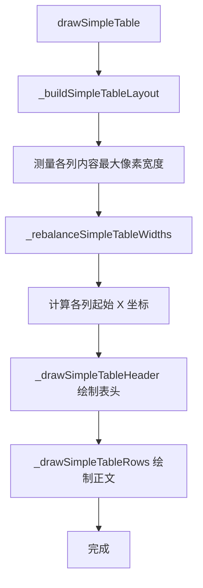
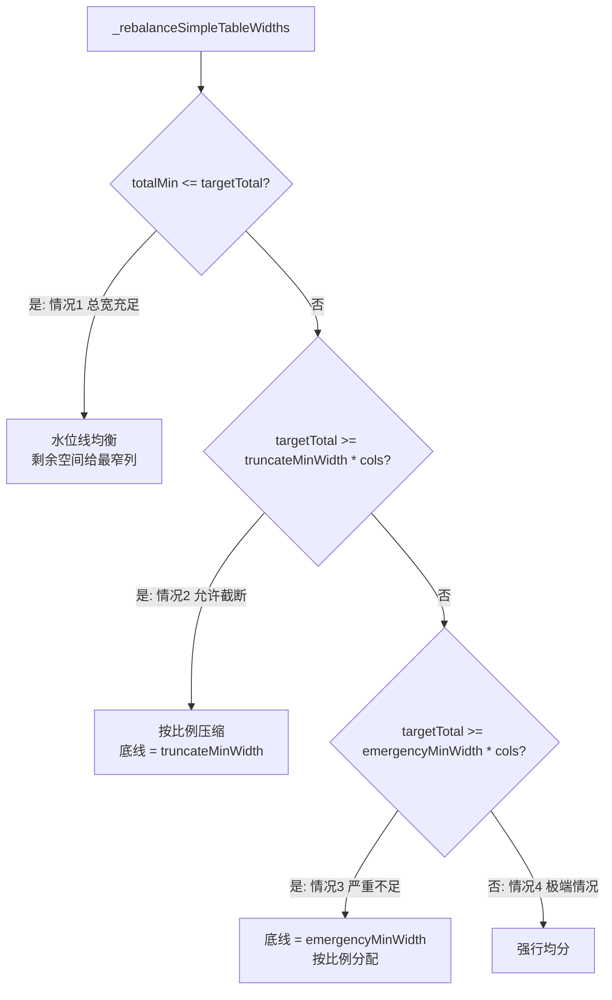
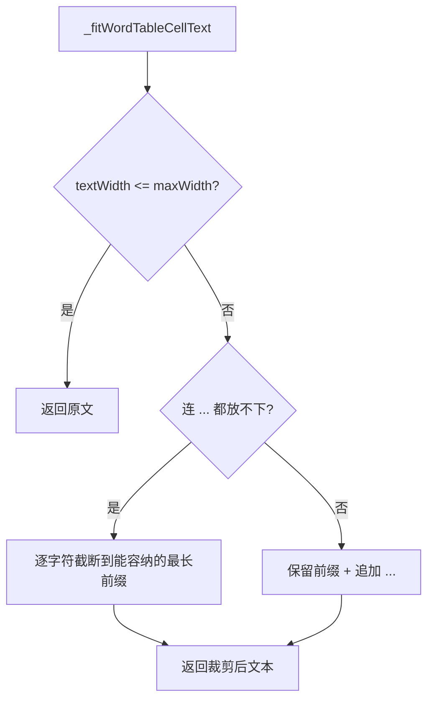

# UtilsTable.ino

> 最后更新日期: 2026/07/29

## 作用

`UtilsTable.ino` 是项目的**通用表格绘制工具**。提供可复用的表格布局与绘制函数，在统计页面等场景中以统一风格展示结构化数据。

表格绘制要点：
- 表头使用灰色字体，数据行使用白色字体，表头下方绘制水平分隔线
- 列布局根据列数自动计算
- 采用水位线算法 + 截断降级的列宽均衡分配策略
- 单元格超宽时自动裁剪并在末尾追加 `...`

## 核心函数

### 公共函数

| 函数 | 作用 |
|------|------|
| `drawSimpleTable(cv, headers, rows)` | 在画布上绘制带表头和分隔线的通用简易表格 |

**参数说明：**

| 参数 | 类型 | 说明 |
|------|------|------|
| `cv` | `M5Canvas &` | 目标画布引用 |
| `headers` | `const std::vector<String> &` | 表头字符串列表 |
| `rows` | `const std::vector<std::vector<String>> &` | 二维字符串数组，每个子数组为一行数据 |

### 内部辅助函数

| 函数 | 作用 |
|------|------|
| `_buildSimpleTableLayout(cv, headers, rows, headerSize, bodySize, &colXs, &colWidths)` | 计算表格列布局：测量内容宽度 → 调用均衡分配 → 计算各列起始 X 坐标 |
| `_drawSimpleTableHeader(cv, headers, colXs, colWidths, cols, startY, rowHeight, headerSize)` | 绘制表头文字和表头下方分隔线 |
| `_drawSimpleTableRows(cv, rows, colXs, colWidths, cols, startY, rowHeight, bodySize)` | 逐行绘制正文数据，按列宽裁剪超宽文本 |
| `_rebalanceSimpleTableWidths(targetTotal, minColWidths, &colWidths, truncateMinWidth, emergencyMinWidth)` | 列宽均衡分配算法（四档降级策略） |
| `_fitWordTableCellText(cv, text, maxWidth)` | 将单元格文本裁剪到指定像素宽度内，过长时保留前缀并追加 `...` |
| `_simpleTableTotalWidth(colWidths)` | 计算当前列宽数组的总宽度 |

## 关键流程

### 表格绘制流程



### 列宽均衡算法



### 单元格超宽裁剪



## 重要细节

### 布局参数

| 参数 | 默认值 | 说明 |
|------|:------:|------|
| 最大列数 | 3 | 取 `headers.size()` 与 3 的较小值 |
| 左侧起始补白 | 6 (3列) / 8 (1~2列) | `leftPadding` |
| 右侧补白 | 6 | `rightPadding` |
| 列间距 | 8 | `colGap` |
| 单元格内边距 | 8 | `cellPadding`（左右各一半） |
| 表头 Y 起始 | 34 | `startY` |
| 行高 | 22 | `rowHeight` |
| 表头字号 | 1.0 | `headerSize` |
| 正文字号 | 1.1 | `bodySize` |
| 表头颜色 | `TFT_DARKGREY` | — |
| 正文颜色 | `WHITE` | — |
| 分隔线颜色 | `TFT_DARKGREY` | 表头行底部 |

### 列宽均衡策略

1. **总宽充足**（`targetTotal >= sum(minColWidths)`）：水位线均衡，剩余空间优先给当前最窄的列，直到趋于一致。
2. **允许截断**（`targetTotal >= truncateMinWidth * cols`）：底线为能显示 `...` 的最小宽度，按比例压缩。
3. **严重不足**（`targetTotal >= emergencyMinWidth * cols`）：底线为至少能显示一个字符，按比例分配。
4. **极端情况**：强行均分。

### 超宽裁剪

- 若原文宽度 <= 列宽，直接返回原文。
- 若原文超宽但还能放下 `...`，则保留前缀并追加 `...`。
- 若连 `...` 都无法放下，则逐字符截断到能容纳的最长前缀。

## 使用示例

### 绘制统计表格

```cpp
std::vector<String> headers = {"等级", "数量", "占比"};
std::vector<std::vector<String>> rows = {
    {"1", "12", "20%"},
    {"2", "8",  "13%"},
    {"3", "10", "17%"}
};
drawSimpleTable(canvas, headers, rows);
```

### 绘制词根词缀表

```cpp
std::vector<String> headers = {"词根", "含义", "例词"};
std::vector<std::vector<String>> rows = {
    {"bio", "生命", "biology"},
    {"geo", "地球", "geology"}
};
drawSimpleTable(canvas, headers, rows);
```

## 注意事项

- 表格布局完全自动计算，无需手动指定列 X 坐标和列宽。
- 最大列数为 3，超过 3 列的表头只会处理前 3 列。
- 每行的列数取该行数据与总列数的较小值，数据不足的列跳过。
- 行高和字号固定，超长文本自动裁剪，不会跨列或溢出。
