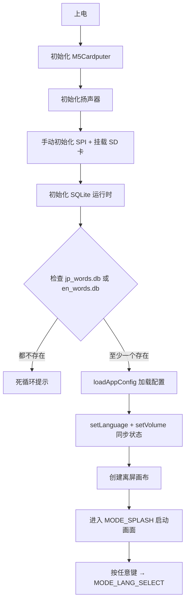

# WordCardputer.ino

> 最后更新日期: 2026/07/29

## 作用

`WordCardputer.ino` 是整个单词学习机的**主程序入口**。它定义全局状态、数据结构、硬件配置，并实现 Arduino 标准的 `setup()` 与 `loop()` 生命周期。所有模式（Mode）与工具（Utils）模块通过函数声明在此汇总，由 `loop()` 根据当前 `appMode` 统一分发。

## 核心对象

### AppMode 枚举

应用运行模式（共 15 种，按顺序排列）：

```
MODE_SPLASH → MODE_LANG_SELECT → MODE_CLASSIFY_SELECT → MODE_FILE_SELECT →
MODE_SCORE_SELECT → MODE_STUDY → MODE_ESC_MENU → MODE_DICTATION →
MODE_DICTATION_REVIEW → MODE_LISTEN → MODE_STATS → MODE_WORD_TABLE →
MODE_WIFI_SCAN → MODE_KEY_HELP → MODE_CLOCK
```

### 核心变量表

| 对象/变量 | 类型 | 说明 |
|----------|------|------|
| `AppMode` | `enum` | 应用运行模式（15 种，见上方列表） |
| `StudyLanguage` | `enum` | 学习语言：`LANG_JP`（日语）、`LANG_EN`（英语） |
| `appMode` | `AppMode` | 当前运行模式 |
| `previousMode` | `AppMode` | 进入 ESC 菜单前的模式，用于退出时恢复 |
| `canvas` | `M5Canvas` | 全局离屏画布，所有 UI 统一在此绘制后再 `pushSprite` 到屏幕 |
| `currentLanguage` | `StudyLanguage` | 当前学习语言 |
| `currentWordRoot` | `String` | 当前词库根路径 |
| `currentAudioRoot` | `String` | 当前音频根路径 |
| `currentSource` | `String` | 当前词库 source 标识 |
| `vocabLabel` | `String` | 当前词库标签（用于展示和 API） |
| `words` | `std::vector<Word>` | 当前加载的词库 |
| `savedWiFiList` | `std::vector<WiFiCredential>` | 已保存的 WiFi 凭据列表 |

### Word 结构体

兼容日/英的单词数据结构，含 `dbId` 字段关联数据库主键：

| 字段 | 类型 | 说明 |
|------|------|------|
| `dbId` | `int` | 数据库主键 |
| `jp` | `String` | 日语假名 |
| `zh` | `String` | 中文释义 |
| `kanji` | `String` | 日语汉字写法 |
| `romaji` | `String` | 罗马音标注 |
| `en` | `String` | 英语单词或短语 |
| `pos` | `String` | 词性 |
| `phonetic` | `String` | IPA 音标 |
| `sentence` | `String` | 例句原文 |
| `sentenceZh` | `String` | 例句中文释义 |
| `root` | `String` | 词根 ID 列表（逗号分隔，仅英语） |
| `affix` | `String` | 词缀 ID 列表（逗号分隔，仅英语） |
| `tone` | `int` | 声调编号，-1 表示无/未知 |
| `score` | `int` | 熟练度 1~5 |

### DictError 结构体

| 字段 | 类型 | 说明 |
|------|------|------|
| `wordIndex` | `int` | 单词在 `words` 中的索引 |
| `wordDbId` | `int` | 单词的数据库主键 |
| `wrong` | `String` | 用户错误输入 |
| `createdAt` | `String` | 错误发生时间 |

### DictationReviewEntry 结构体

| 字段 | 类型 | 说明 |
|------|------|------|
| `errorId` | `int` | 错题记录在 DB 中的主键，用于删除 |
| `wordDbId` | `int` | 单词的数据库主键 |
| `correct` | `String` | 正确答案 |
| `wrong` | `String` | 用户错误输入 |
| `createdAt` | `String` | 错误发生时间 |

### WiFiCredential 结构体

| 字段 | 类型 | 说明 |
|------|------|------|
| `ssid` | `String` | WiFi SSID |
| `pass` | `String` | WiFi 密码 |

### 自动保存

| 变量 | 类型 | 默认值 | 说明 |
|------|------|:------:|------|
| `scoresDirty` | `bool` | `false` | score 变更标记 |
| `dirtyCount` | `int` | `0` | 累计变更计数 |
| `autoSaveThreshold` | `int` | `5` | 自动保存触发阈值 |

### 自动亮度管理

| 变量 | 类型 | 默认值 | 说明 |
|------|------|:------:|------|
| `userAction` | `bool` | `false` | 用户操作标记 |
| `lastActivityTime` | `unsigned long` | `0` | 上次操作时间 |
| `isDimmed` | `bool` | `false` | 是否已降低亮度 |
| `idleTimeout` | `unsigned long` | `60000` | 无操作超时（ms） |
| `normalBrightness` | `uint8_t` | `200` | 正常亮度 |
| `dimBrightness` | `uint8_t` | `40` | 省电亮度 |
| `loopDelay` | `int` | `30` | 主循环延迟（ms） |

### 语言选择

| 变量 | 类型 | 默认值 | 说明 |
|------|------|:------:|------|
| `langItems` | `std::vector<String>` | `{"日语", "英语"}` | 语言选择列表 |
| `langIndex` | `int` | `0` | 语言选择索引 |

### 分类方式选择

| 变量 | 类型 | 默认值 | 说明 |
|------|------|:------:|------|
| `classifyItems` | `std::vector<String>` | `{"按词源分类", "按Score分类"}` | 分类方式列表 |
| `classifyIndex` | `int` | `0` | 分类选择索引 |

### ESC 菜单

| 变量 | 类型 | 说明 |
|------|------|------|
| `escMenuGroup` | `EscMenuGroup` | ESC 菜单分组状态（`ESC_MENU_ROOT` / `ESC_MENU_VOCAB` / `ESC_MENU_MODE`） |
| `escRootItems` | `std::vector<String>` | ESC 根菜单项 |
| `escVocabItems` | `std::vector<String>` | 词库相关子菜单项 |
| `escModeItems` | `std::vector<String>` | 模式切换子菜单项 |
| `escRootIndex` / `escRootScroll` | `int` | 根菜单选择/滚动 |
| `escVocabIndex` / `escVocabScroll` | `int` | 词库菜单选择/滚动 |
| `escModeIndex` / `escModeScroll` | `int` | 模式菜单选择/滚动 |

### 词源选择（ModeSourceSelect）

| 变量 | 类型 | 说明 |
|------|------|------|
| `files` | `std::vector<String>` | 文件/目录列表 |
| `fileExpandable` | `std::vector<bool>` | 是否为可展开的 source |
| `selectedSource` | `String` | 已选 source 标识 |
| `selectedChapter` | `String` | 已选 chapter 标识 |
| `fileIndex` / `fileScroll` | `int` | 文件列表选择/滚动 |

### 按 Score 选择（ModeScoreSelect）

| 变量 | 类型 | 说明 |
|------|------|------|
| `scoreLevel` | `int` | `0`=选择级别, `1`=选择分组 |
| `scoreListIndex` / `scoreListScroll` | `int` | 级别列表选择/滚动 |
| `groupListIndex` / `groupListScroll` | `int` | 分组列表选择/滚动 |
| `selectedScore` | `int` | 已选分数 |
| `scoreWordCounts[6]` | `int` | 各分数单词数（索引 1~5） |

### 学习模式（ModeStudy）

| 变量 | 类型 | 默认值 | 说明 |
|------|------|:------:|------|
| `wordIndex` | `int` | `0` | 当前单词索引 |
| `studyPage` | `int` | `0` | 学习页面页号 |
| `showMeaning` | `bool` | `false` | 是否显示释义 |
| `showSentenceZh` | `bool` | `false` | 是否显示例句中文 |
| `showAnkiSideA` | `bool` | `true` | 是否显示正面 |
| `showRoots` | `bool` | `true` | 是否显示词根词缀 |

### 听写模式（ModeDictation）

| 变量 | 类型 | 说明 |
|------|------|------|
| `dictOrder` | `std::vector<int>` | 听写顺序（单词索引列表） |
| `dictPos` | `int` | 当前听写位置 |
| `commitText` | `String` | 已提交文本 |
| `romajiBuffer` | `String` | 罗马音缓冲区 |
| `candidateKana` | `String` | 候选假名 |
| `dictEnInput` | `String` | 英语输入缓冲区 |
| `correctCount` / `wrongCount` | `int` | 正确/错误计数 |
| `dictShowSummary` | `bool` | 是否显示汇总页 |
| `useKatakana` | `bool` | 是否使用片假名 |

### 听写回顾（ModeDictationReview）

| 变量 | 类型 | 说明 |
|------|------|------|
| `dictErrors` | `std::vector<DictError>` | 本次听写错误记录 |
| `dictationReviewEntries` | `std::vector<DictationReviewEntry>` | 历史错题回顾列表 |
| `dictationReviewIndex` | `int` | 当前回顾索引 |
| `dictationReviewTitle` | `String` | 回顾页标题 |

### 听读模式（ModeListen）

| 变量 | 类型 | 默认值 | 说明 |
|------|------|:------:|------|
| `listenPlayCount` | `int` | `0` | 播放计数 |
| `listenNextActionTime` | `unsigned long` | `0` | 下次操作时间 |
| `listenRepeatInterval` | `const unsigned long` | `1200` | 重复间隔（ms） |
| `listenNextWordDelay` | `const unsigned long` | `600` | 切换单词延迟（ms） |

### 统计模式（ModeStats）

| 变量 | 类型 | 说明 |
|------|------|------|
| `statsTotal` | `int` | 总单词数 |
| `statsAvg` | `float` | 平均分 |
| `statsMedian` | `float` | 中位数 |
| `statsCounts[6]` | `int` | 各分数分布 |
| `statsLevel` | `String` | 掌握程度标签 |
| `statsPage` | `int` | 统计页面页号 |

### 词表模式（ModeWordTable）

| 变量 | 类型 | 默认值 | 说明 |
|------|------|:------:|------|
| `wordTableScore` | `int` | `1` | 当前词表筛选分数 |
| `wordTablePage` | `int` | `0` | 当前词表页号 |
| `wordTableRowsPerPage` | `const int` | `3` | 每页行数 |
| `wordTableFilteredIndices` | `std::vector<int>` | | 当前分数筛选后的词索引列表 |

### WiFi 扫描（ModeWiFiScan）

| 变量 | 类型 | 说明 |
|------|------|------|
| `wifiScanState` | `WiFiScanState` | WiFi 扫描状态 |
| `wifiSSIDs` / `wifiRawSSIDs` | `std::vector<String>` | 扫描到的 SSID 列表 |
| `wifiListIndex` / `wifiListScroll` | `int` | SSID 列表选择/滚动 |
| `wifiSelectedSSID` | `String` | 已选 SSID |
| `wifiPasswordInput` | `String` | 密码输入缓冲区 |
| `wifiConnectSuccess` | `bool` | 连接是否成功 |
| `wifiPage` | `int` | WiFi 页面页号 |

### KeyHelp

| 变量 | 类型 | 说明 |
|------|------|------|
| `helpSections` | `std::vector<HelpSectionData>` | 帮助分类数据 |
| `helpSectionIndex` | `int` | 当前帮助分类索引 |
| `helpPageIndex` | `int` | 当前帮助页索引 |

### Web 服务器

| 变量 | 类型 | 说明 |
|------|------|------|
| `server` | `WebServer` | HTTP 服务器实例 |
| `webServerRunning` | `bool` | 服务器是否运行中 |
| `uploadFile` | `File` | 上传临时文件 |
| `uploadTempPath` | `String` | 上传临时路径 |
| `uploadTargetSource` | `String` | 上传目标 source |
| `uploadTargetChapter` | `String` | 上传目标 chapter |
| `uploadError` | `String` | 上传错误信息 |
| `uploadImportedCount` | `int` | 已导入词条数 |

### 音量与音效

| 变量 | 类型 | 默认值 | 说明 |
|------|------|:------:|------|
| `soundVolume` | `int` | `192` | 音量 0~255 |
| `volumeMessageDeadline` | `unsigned long` | `0` | 音量提示截止时间 |

### 其他

| 变量 | 类型 | 说明 |
|------|------|------|
| `visibleLines` | `const int` | 可见行数（`4`） |
| `wifiConnected` | `bool` | WiFi 连接状态 |

## 关键流程

### 启动流程



### 主循环流程

```mermaid
flowchart TD
    A[M5Cardputer.update] --> B[重置 userAction]
    B --> C{appMode 分发}
    C -->|SPLASH| S[loopSplashMode]
    C -->|LANG_SELECT| D[loopLanguageSelectMode]
    C -->|CLASSIFY_SELECT| CD[loopClassifySelectMode]
    C -->|FILE_SELECT| E[loopFileSelectMode]
    C -->|SCORE_SELECT| CS[loopScoreSelectMode]
    C -->|STUDY| F[loopStudyMode]
    C -->|ESC_MENU| G[loopEscMenuMode]
    C -->|DICTATION| H[loopDictationMode]
    C -->|DICTATION_REVIEW| I[loopDictationReviewMode]
    C -->|LISTEN| J[loopListenMode]
    C -->|STATS| K[loopStatsMode]
    C -->|WORD_TABLE| WT[loopWordTableMode]
    C -->|WIFI_SCAN| L[loopWiFiScanMode]
    C -->|KEY_HELP| M[loopKeyHelpMode]
    C -->|CLOCK| CL[loopClockMode]
    S & D & CD & E & CS & F & G & H & I & J & K & WT & L & M & CL --> N[handleWebServer]
    N --> O{空闲检测}
    O -->|有操作| P[恢复亮度 + loopDelay=30]
    O -->|空闲 > idleTimeout| Q[降低亮度 + loopDelay=200]
    P --> R[delay(loopDelay)]
    Q --> R
```

## 重要细节

- **SD 卡 SPI 引脚**：SCK=40、MISO=39、MOSI=14、CS=12，SPI 频率 25 MHz。
- **启动检查**：`setup()` 检查 SQLite 数据库文件（`jp_words.db` / `en_words.db`）是否存在，至少需要一个数据库才能继续。
- **启动画面**：设备开机后先展示 ASCII Logo 启动画面（ModeSplash），按任意键后进入语言选择。
- **分类方式选择**：语言选择后进入分类方式选择（ModeClassifySelect），支持"按词源分类"和"按 Score 分类"两种方式。
- **按 Score 分类**：选择 Score 后加载该分数下的单词（每组 ≤50 词），无需经过词源选择。
- **配置加载**：`setup()` 中调用 `loadAppConfig()` 从 `config.json` 加载音量、亮度、语言、自动保存阈值等设置，并兼容旧版 `wifi.json` 自动迁移。
- **SQLite 初始化**：`sqlite3_initialize()` 在 SD 卡挂载后立即执行。
- **自动节能**：`idleTimeout` 默认为 60000 ms；无操作时亮度降至 `dimBrightness`（默认 40），loop 延迟从 30 ms 提升到 200 ms。
- **自动保存阈值**：`autoSaveThreshold` 可配置（默认 5），每累计 N 次 score 变更触发一次数据库写回。
- **双缓冲绘制**：所有模式共享同一个 `M5Canvas` 离屏画布，避免闪烁。
- **例句与词根词缀**：学习模式下可通过 `BtnA` 切换例句中文释义显示，词根词缀解析需数据库中存在 `en_word_roots` / `en_word_affixes` 关联表。

## 使用示例

### 添加新模式

若新增 `MODE_XXX`，需完成以下三步：

```cpp
// 1. 在 enum AppMode 中追加
enum AppMode {
    // ...
    MODE_XXX,
};

// 2. 在 loop() 中添加分发
else if (appMode == MODE_XXX) {
    loopXxxMode();
}

// 3. 在 globals.h 中声明函数
void initXxxMode();
void loopXxxMode();
```

## 注意事项

- `setup()` 中若 SD 卡初始化失败或词库数据库不存在，会进入死循环并在屏幕上打印错误，必须重启或修复 SD 卡。
- `loopDelay` 在省电模式下变长，因此学习/听写等依赖键盘响应的模式应通过 `M5Cardputer.update()` 和 `Keyboard.isChange()` 自行保证实时性，不依赖固定 loop 周期。
- `M5Cardputer.BtnA` 与 `M5Cardputer.Keyboard` 分属两个体系，在 `loop*` 类函数中不要把两者的检查进行嵌套。
- Web 服务器 `handleWebServer()` 在主循环末尾调用，即使未连接 WiFi 也会检查一次 `webServerRunning` 标志，开销极小。
- `Word` 结构体中的 `dbId` 字段是数据库主键，用于 score 回写；`loadWordsFromDB()` 会填充此字段。
- `Word.root` 和 `Word.affix` 字段存储的是逗号分隔的 ID 列表，需要通过 `loadRootAffixNames()` 查询 `en_roots` / `en_affixes` 表获取名称和释义。
